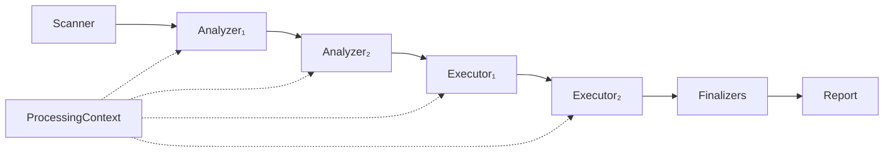
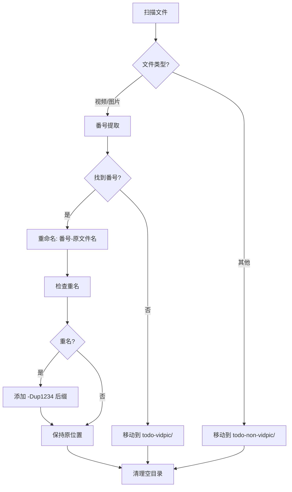

# j-file-kit

[](https://www.python.org/downloads/)
[](https://pydantic.dev/)
[](LICENSE)
[](https://github.com/your-repo/j-file-kit)

基于 Python 的现代化文件管理工具，采用管道/过滤器架构设计，支持自定义规则的文件操作。专为处理大量文件而设计，特别适合视频文件整理、媒体库管理等场景。

> **当前状态**: v0.1.0 - 核心功能已实现，支持完整的文件处理管道和视频文件整理功能

## ✨ 核心特性

- **🏗️ 管道/过滤器架构**：Scanner → Analyzer → Executor → Finalizer，模块化设计
- **🔧 自定义规则扩展**：支持 Python 代码编写自定义处理规则
- **⚡ 流式处理**：边扫描边执行，支持百万级文件处理
- **🛡️ 错误容错**：跳过失败项，继续处理，最后生成完整报告
- **📝 事务日志**：记录所有操作，支持手动回滚
- **⚙️ 配置驱动**：YAML 配置文件，支持多任务管理
- **🎯 类型安全**：基于 Pydantic v2，端到端类型检查
- **📊 丰富报告**：详细的处理报告和统计信息
- **📁 多根目录**：支持同时扫描多个目录，统一处理

## 🏗️ 核心架构

### 管道/过滤器模式



**组件说明**：
- **Scanner**: 遍历文件目录，生成 `FileInfo` 流
- **Analyzer**: 分析文件，填充 `ProcessingContext`（如分类、番号提取）
- **Executor**: 根据 Context 执行操作（如重命名、移动）
- **Finalizer**: 全局后处理（如清理空目录）
- **Pipeline**: 协调流程，支持短路机制

### 📊 数据模型

| 模型 | 描述 | 用途 |
|------|------|------|
| `FileInfo` | 文件基础信息 | 轻量级文件元数据 |
| `ProcessingContext` | 处理上下文 | 携带分析结果和中间状态 |
| `ProcessorResult` | 处理器结果 | 单个处理器的执行结果 |
| `TaskResult` | 任务结果 | 单个文件的完整处理结果 |
| `TaskReport` | 任务报告 | 任务汇总统计和日志 |

## 🎯 典型使用场景

### 📹 视频文件整理

对指定目录进行视频/图片文件的番号提取和整理：



**处理流程**：
1. **分类处理**：视频/图片文件进入番号提取流程，其他文件移动到 `todo-non-vidpic/`
2. **番号提取**：使用正则 `(?<![a-zA-Z])([a-zA-Z]{2,5})[-_]?(\\d{2,5})(?![0-9])` 提取番号
   - 支持格式：`ABC-123`、`ABC_123`、`ABC123`
   - 字母：2-5个英文字母（大小写都可以）
   - 分隔符：可选（`-`、`_` 或无）
   - 数字：2-5个数字
   - 边界条件：前面不能紧挨字母，后面不能紧挨数字
3. **智能重命名**：番号前置，重名时添加随机后缀
4. **分类归档**：有番号保持原位，无番号移动到 `todo-vidpic/`
5. **清理维护**：删除处理后的空目录

## 🚀 快速开始

### 📦 环境要求

- Python 3.14+
- uv (推荐) 或 pip

### 1. 安装依赖

```bash
# 克隆项目
git clone <repository-url>
cd j-file-kit

# 使用 uv 安装（推荐）
uv sync

# 或使用 pip
pip install -e .
```

### 2. 创建配置文件

创建 `config.yaml` 文件：

```yaml
# 全局配置
global:
  scan_roots:                                    # 扫描根目录列表
    - /path/to/your/files                       # 修改为你的文件目录
  log_dir: ./logs                               # 日志目录
  report_dir: ./reports                         # 报告目录

# 任务列表
tasks:
  - name: video_file_organizer
    type: file_organize
    enabled: true
    config:
      # 目标目录配置
      todo_non_vidpic_dir: /path/to/todo-non-vidpic  # 非视频图片文件目录
      todo_vidpic_dir: /path/to/todo-vidpic          # 无番号视频图片文件目录
      
      # 文件类型配置
      video_extensions: [.mp4, .avi, .mkv, .mov, .wmv, .flv, .webm]
      image_extensions: [.jpg, .jpeg, .png, .webp, .bmp, .gif, .tiff]
      
      # 番号规则已内置，无需配置
      
      # 可选配置
      dry_run: false
      backup: false
      max_file_size: 1073741824
      min_file_size: 1048576
```

### 📁 多扫描根目录支持

j-file-kit 支持配置多个扫描根目录，可以同时处理来自不同位置的文件：

```yaml
# 全局配置
global:
  scan_roots:                                    # 扫描根目录列表
    - /path/to/videos                           # 视频文件目录
    - /path/to/downloads                       # 下载目录
    - /path/to/external_drive                  # 外部存储
    - /path/to/backup                          # 备份目录
  log_dir: ./logs
  report_dir: ./reports
```

**优势**：
- **统一处理**：一次配置，处理多个目录
- **灵活组织**：支持不同来源的文件整理
- **高效扫描**：并行扫描多个目录
- **向后兼容**：仍支持单个目录配置

### 3. 运行任务

#### 方式一：使用内置的视频文件整理器

```python
from jfk.rules.video_organizer import VideoFileOrganizer

# 创建整理器
organizer = VideoFileOrganizer("config.yaml")

# 预览模式（推荐先运行）
preview_report = organizer.run_dry()
print(f"预览模式将处理 {preview_report.total_files} 个文件")

# 实际执行
report = organizer.run()
print(f"处理完成: 成功 {report.success_files}, 失败 {report.error_files}")
```

#### 方式二：使用管道 API

```python
from jfk.core.pipeline import Pipeline
from jfk.core.config import load_config
from jfk.processors.analyzers import FileClassifier, SerialIdExtractor
from jfk.processors.executors import FileRenamer, FileMover
from jfk.processors.finalizers import EmptyDirCleaner, ReportGenerator

# 加载配置
config = load_config("config.yaml")

# 创建管道
pipeline = Pipeline(config)

# 添加处理器
pipeline.add_analyzer(FileClassifier({".mp4", ".avi"}, {".jpg", ".png"}))
pipeline.add_analyzer(SerialIdExtractor())
pipeline.add_executor(FileRenamer(pipeline.transaction_log))
pipeline.add_executor(FileMover("/path/to/todo_vidpic", pipeline.transaction_log))
pipeline.add_finalizer(EmptyDirCleaner(config.global_.scan_roots[0], pipeline.transaction_log))
pipeline.add_finalizer(ReportGenerator("./reports", pipeline.report))

# 执行任务
report = pipeline.run()
print(f"任务完成: {report.success_rate:.2%} 成功率")
```

## 📋 番号规则说明

### 🎯 内置番号格式

j-file-kit 使用固定的内置番号正则表达式（不可自定义）：
`(?<![a-zA-Z])([a-zA-Z]{2,5})[-_]?(\d{2,5})(?![0-9])`

### 📏 规则详情
- **字母部分**：2-5个英文字母（大小写都可以）
- **分隔符**：可选，支持 `-`、`_` 或无分隔符
- **数字部分**：2-5个数字
- **边界条件**：
  - 番号前面不能紧挨着字母
  - 番号后面不能紧挨着数字
- **输出格式**：统一标准化为 `字母-数字` 格式（大写字母）

**注意**: 番号规则已内置于系统中，无法通过配置文件修改。

## 💡 使用示例

### 示例 1：视频文件整理

```python
from jfk.rules.video_organizer import VideoFileOrganizer

# 创建配置文件
config_content = """
global:
  scan_roots: ["/path/to/videos"]
  log_dir: ./logs
  report_dir: ./reports

tasks:
  - name: video_organizer
    type: file_organize
    enabled: true
    config:
      todo_non_vidpic_dir: "/path/to/todo-non-vidpic"
      todo_vidpic_dir: "/path/to/todo-vidpic"
      video_extensions: [.mp4, .avi, .mkv]
      image_extensions: [.jpg, .png]
"""

with open("config.yaml", "w") as f:
    f.write(config_content)

# 运行整理
organizer = VideoFileOrganizer("config.yaml")
report = organizer.run()

print(f"处理完成: {report.success_files} 成功, {report.error_files} 失败")
```

### 示例 2：自定义文件处理

```python
from jfk.core.pipeline import Pipeline
from jfk.core.config import TaskConfig, GlobalConfig, TaskDefinition
from jfk.processors.analyzers import FileClassifier, SerialIdExtractor
from jfk.processors.executors import FileRenamer, FileMover

# 创建配置
config = TaskConfig(
    global_=GlobalConfig(scan_roots=["/path/to/files"]),
    tasks=[TaskDefinition(
        name="custom_task",
        type="file_organize",
        enabled=True,
        config={}
    )]
)

# 创建管道
pipeline = Pipeline(config)

# 添加自定义处理器
pipeline.add_analyzer(FileClassifier({".mp4", ".avi"}, {".jpg", ".png"}))
pipeline.add_analyzer(SerialIdExtractor())
pipeline.add_executor(FileRenamer(pipeline.transaction_log))

# 运行
report = pipeline.run()
```

## 🔧 扩展开发

### 自定义分析器

```python
from __future__ import annotations

from jfk.core.models import ProcessingContext, ProcessorResult
from jfk.core.processor import Analyzer

class CustomAnalyzer(Analyzer):
    """自定义分析器示例"""
    
    def process(self, ctx: ProcessingContext) -> ProcessorResult:
        """处理文件分析逻辑"""
        # 自定义分析逻辑
        if ctx.file_info.suffix == '.custom':
            ctx.custom_flag = True
            ctx.custom_data = {"processed": True}
            
        return ProcessorResult(
            status='success',
            message=f"Custom analyzer applied to {ctx.file_info.name}"
        )
```

### 自定义执行器

```python
from jfk.core.models import ProcessingContext, ProcessorResult
from jfk.core.processor import Executor

class CustomExecutor(Executor):
    """自定义执行器示例"""
    
    def process(self, ctx: ProcessingContext) -> ProcessorResult:
        """执行文件操作"""
        try:
            # 自定义操作逻辑
            if ctx.custom_flag:
                # 执行自定义操作
                pass
                
            return ProcessorResult(
                status='success',
                message=f"Custom operation completed for {ctx.file_info.name}"
            )
        except Exception as e:
            return ProcessorResult.error(f"Custom operation failed: {str(e)}")
```

### 使用自定义处理器

```python
from jfk.core.pipeline import Pipeline
from jfk.core.config import load_config

# 加载配置
config = load_config("config.yaml")

# 创建管道并添加自定义规则
pipeline = Pipeline(config)
pipeline.add_analyzer(CustomAnalyzer())
pipeline.add_executor(CustomExecutor())

# 执行任务
report = pipeline.run()
```

### 处理器类型

| 类型 | 基类 | 用途 | 示例 |
|------|------|------|------|
| **Analyzer** | `Analyzer` | 分析文件，填充上下文 | 番号提取、文件分类 |
| **Executor** | `Executor` | 执行文件操作 | 重命名、移动、复制 |
| **Finalizer** | `Finalizer` | 全局后处理 | 清理空目录、生成报告 |

## 📁 项目结构

```
j-file-kit/
├── 📦 jfk/                      # 主包
│   ├── 🏗️ core/                 # 核心抽象层
│   │   ├── models.py            # 数据模型 (FileInfo, ProcessingContext, etc.)
│   │   ├── config.py            # 配置模型和加载器
│   │   ├── scanner.py           # 文件扫描器
│   │   ├── pipeline.py          # 管道协调器
│   │   └── processor.py         # Processor 协议定义
│   ├── ⚙️ processors/           # 内置处理器
│   │   ├── analyzers.py         # 分析器 (文件分类、番号提取等)
│   │   ├── executors.py         # 执行器 (重命名、移动等)
│   │   └── finalizers.py        # 终结器 (清理、报告等)
│   ├── 🔧 rules/                # 用户扩展点和内置规则
│   │   └── video_organizer.py   # 视频文件整理器
│   └── 🛠️ utils/                # 工具函数
│       ├── logger.py            # 结构化日志
│       ├── transaction_log.py   # 事务日志
│       ├── file_utils.py         # 文件工具
│       └── regex_patterns.py    # 正则模式
├── 🧪 tests/                    # 测试套件
│   ├── unit/                    # 单元测试
│   ├── integration/             # 集成测试
│   └── conftest.py             # 测试配置
├── 📊 logs/                    # 日志输出目录
├── 📈 reports/                 # 报告输出目录
├── 📄 main.py                  # 主入口文件 (待完善)
├── 📋 pyproject.toml           # 项目配置
└── 🔒 uv.lock                  # 依赖锁定文件
```

### 🏗️ 架构层次

| 层次 | 目录 | 职责 | 依赖关系 |
|------|------|------|----------|
| **应用层** | `main.py` | 程序入口 | 依赖核心层 |
| **核心层** | `jfk/core/` | 抽象定义、流程控制 | 无外部依赖 |
| **处理器层** | `jfk/processors/` | 内置处理器实现 | 依赖核心层 |
| **扩展层** | `jfk/rules/` | 用户自定义规则 | 依赖核心层 |
| **工具层** | `jfk/utils/` | 通用工具函数 | 无外部依赖 |

## 🛠️ 开发指南

### 🧪 测试

```bash
# 运行所有测试
pytest

# 运行单元测试
pytest tests/unit/

# 运行集成测试
pytest tests/integration/

# 生成覆盖率报告
pytest --cov=jfk --cov-report=html

# 运行特定测试
pytest tests/unit/test_file_utils.py::test_extract_serial_id
```

### 🔍 代码质量

```bash
# 代码格式化
ruff format

# 代码检查
ruff check

# 类型检查
mypy jfk/

# 运行所有检查
ruff check && mypy jfk/ && pytest
```

### 📦 依赖管理

```bash
# 添加新依赖
uv add package-name

# 添加开发依赖
uv add --dev package-name

# 更新依赖
uv lock --upgrade

# 同步环境
uv sync
```

### 🚀 开发环境设置

1. **克隆项目**：
   ```bash
   git clone <repository-url>
   cd j-file-kit
   ```

2. **安装开发环境**：
   ```bash
   uv sync --dev
   ```

3. **运行测试**：
   ```bash
   # 运行所有测试
   pytest
   
   # 运行单元测试
   pytest tests/unit/
   
   # 运行集成测试
   pytest tests/integration/
   
   # 生成覆盖率报告
   pytest --cov=jfk --cov-report=html
   ```

4. **代码质量检查**：
   ```bash
   # 代码格式化
   ruff format
   
   # 代码检查
   ruff check
   
   # 类型检查
   mypy jfk/
   
   # 运行所有检查
   ruff check && mypy jfk/ && pytest
   ```

## 🚀 未来规划

### 🎯 短期目标 (v0.2.0)

- **🔧 命令行工具**：完整的 CLI 接口支持 (`jfk` 命令)
- **📝 更多示例**：丰富的使用示例和最佳实践
- **🌐 Web UI**：基于 FastAPI 的 HTTP 接口和 Web 界面
- **📊 实时监控**：处理进度实时显示和状态监控

### 🎯 中期目标 (v0.5.0)

- **🗄️ 数据库持久化**：SQLite/PostgreSQL 支持，断点续扫
- **🐳 Docker 部署**：支持容器化部署
- **🔄 增量处理**：只处理变更的文件
- **📈 性能优化**：多线程/异步处理支持

### 🎯 长期目标 (v1.0.0)

- **🤖 AI 集成**：智能文件分类和内容识别
- **☁️ 云存储支持**：支持 S3、Google Drive 等
- **🔌 插件系统**：更强大的扩展机制
- **📱 移动端支持**：移动设备管理界面

## 📊 项目状态

| 功能模块 | 状态 | 完成度 | 说明 |
|---------|------|--------|------|
| 核心架构 | ✅ | 100% | 管道/过滤器架构完整实现 |
| 文件扫描 | ✅ | 100% | 支持多目录扫描和过滤 |
| 分析器 | ✅ | 100% | 文件分类、番号提取等 |
| 执行器 | ✅ | 100% | 重命名、移动、删除等 |
| 终结器 | ✅ | 100% | 清理、报告生成等 |
| 视频整理 | ✅ | 100% | 完整的视频文件整理流程 |
| 配置系统 | ✅ | 100% | YAML 配置和验证 |
| 日志系统 | ✅ | 100% | 结构化日志和事务记录 |
| 测试覆盖 | ✅ | 95% | 单元测试和集成测试 |
| CLI 工具 | 🚧 | 10% | 基础框架，待完善 |
| Web UI | ❌ | 0% | 计划中 |

## 📄 许可证

本项目采用 [MIT License](LICENSE) 许可证。

## 🤝 贡献指南

欢迎贡献代码！请遵循以下步骤：

1. Fork 本仓库
2. 创建特性分支 (`git checkout -b feature/AmazingFeature`)
3. 提交更改 (`git commit -m 'Add some AmazingFeature'`)
4. 推送到分支 (`git push origin feature/AmazingFeature`)
5. 创建 Pull Request

### 贡献规范

- 遵循项目的代码风格和类型注解要求
- 添加适当的测试覆盖
- 更新相关文档
- 确保所有测试通过
