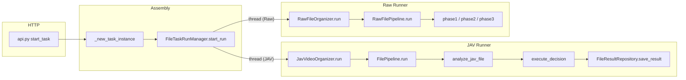

# 架构设计文档

本文档面向 **后续接手的开发者与 AI Agent**：用最少上下文说明 **职责边界、依赖方向、一次任务从 HTTP 到磁盘的完整链路**，以及 **该改哪几个文件**。细节实现以源码与 docstring 为准。

---

## 0. 代码定位速览（按职责找目录）

| 逻辑主题 | 主要目录 / 文件 |
|------|------|
| Raw 收件箱三阶段编排 | `application/raw_pipeline/`：`pipeline.py`、`phase1.py`、`phase2.py`（编排）、`phase2_preflight.py`、`phase2_delete_move.py`、`phase2_clean.py`、`phase2_collapse.py`、`phase2_classify.py`、`phase3.py` |
| Raw 阶段共享上下文与计数 | `application/raw_pipeline/context.py`、`application/raw_pipeline/counters.py` |
| 名称关键字 token 边界匹配（Raw / JAV 共用） | `shared/utils/name_keyword_match.py` |
| JAV 单文件分析编排 | `application/jav_analysis/runner.py` |
| JAV 分析规则域 | `application/jav_analysis/classify.py`、`application/jav_analysis/inbox.py`、`application/jav_analysis/misc.py`、`application/jav_analysis/archive.py`、`application/jav_analysis/media.py` |
| JAV 扫描执行管线 | `application/jav_pipeline/pipeline.py`、`application/jav_pipeline/item_processor.py`、`application/jav_pipeline/result_mapper.py` |
| JAV 管线执行器与观测 | `application/jav_pipeline/executor.py`、`application/jav_pipeline/observer.py`、`application/jav_pipeline/directory_cleanup.py` |
| 任务配置模型与公共约束 | `application/jav_task_config.py`、`application/raw_task_config.py`、`application/config_common.py`、`application/default_task_configs.py` |
| 文件任务领域模型与协议 | `domain/file_types.py`、`domain/serial_id.py`、`domain/task_run.py`、`domain/task_errors.py`、`domain/task_runner.py`、`domain/task_config.py` |
| **前端页面与交互** | `frontend/src/`：`api/`（TanStack Query hooks）、`pages/`（路由页面）、`components/`（共享组件）|
| **前端构建产物（由 FastAPI 服务）** | `src/j_file_kit/static/`（`vite build` 输出，不提交 git）|

---

## 1. 项目是什么

- **形态**：单进程 HTTP 服务（FastAPI + uvicorn），默认 Docker 部署；宿主机挂载 **`/data`**（应用状态）与 **`/media`**（媒体树）。
- **主业务一 — JAV 整理**：`jav_video_organizer` 任务从 **`workspace_root`**（默认 **`/media/jav_workspace`**）的 **`inbox`** 递归扫描 → 番号/扩展名规则分析 → 移动/删除/跳过 → 结果写入 SQLite；可选 **dry_run** 预览。详见 **[JAV_VIDEO_PROCESSING_PIPELINE.md](./JAV_VIDEO_PROCESSING_PIPELINE.md)**。
- **主业务二 — Raw 整理**：`raw_file_organizer` 任务从 **`workspace_root`**（默认 **`/media/raw_workspace`**）的 **`inbox`** 第一层三阶段处理：散落文件收入暂存 → 子目录关键字/清洗/折叠/分类 → 暂存文件分流。详见 **[RAW_FILE_PROCESSING_PIPELINE.md](./RAW_FILE_PROCESSING_PIPELINE.md)**。
- **附属能力**：`/api/media` 下对 **`MEDIA_ROOT`（`/media`）** 的目录懒加载列举（与整理任务解耦）。
- YAML 仅持久化 `workspace_root`，其余子目录名由 [`application/config_common.py`](../src/j_file_kit/app/file_task/application/config_common.py) 集中约定。

依赖与版本以仓库根目录 **`pyproject.toml`** 为准。

---

## 2. 分层与依赖规则（必读）

采用 **按领域分包**，领域内再分 **`domain`（模型、协议、异常）** 与 **`application`（用例、管道、纯函数编排）**；**`infrastructure`** 实现 **`domain/ports`** 中的 Protocol；**`api`** 只做 **Composition Root + HTTP**，不写业务分支逻辑。

```text
api/                    # FastAPI 工厂、lifespan、路由注册、全局异常映射；AppState 组装
  └── app_state.py      # 唯一集中装配：SQLite、YAML 仓储、FileTaskRunManager、路径

app/<domain>/           # 业务：domain + application；禁止 import infrastructure
shared/                 # 无业务语义：MEDIA_ROOT、文件/日志工具
infrastructure/         # 实现 ports：SQLite、YAML、FileTaskRunManager
```

**合法依赖方向**

- `app/*/domain` → `shared` only  
- `app/*/application` → `shared` + 本领域 `domain`  
- `infrastructure` → `shared` + `app`（实现 ports、调用领域类型）  
- `api` → 全部（组装根）

---

## 3. 目录结构（与源码一致）

```text
src/j_file_kit/
├── main.py                         # CLI：argparse + uvicorn.run(create_app())
├── api/
│   ├── app.py                      # create_app()、lifespan、健康检查、领域异常 → JSON
│   └── app_state.py                # AppState：仓储 + FileTaskRunManager
├── app/
│   ├── file_task/
│   │   ├── api.py                  # POST /api/tasks/{task_type}/start 等
│   │   ├── config_api.py           # 任务配置 CRUD/校验
│   │   ├── domain/
│   │   │   ├── file_types.py       # PathEntryType、FileType
│   │   │   ├── serial_id.py        # SerialId、番号数字校验
│   │   │   ├── task_run.py         # FileTaskRun*、状态/触发枚举、统计
│   │   │   ├── task_errors.py      # FileTask*Error
│   │   │   ├── task_runner.py      # FileTaskRunner Protocol
│   │   │   ├── task_config.py      # TaskConfig
│   │   │   ├── decisions.py        # Move/Delete/Skip + FileItemData
│   │   │   ├── ports.py            # FileTaskRunRepository、FileResultRepository、TaskConfigRepository
│   │   │   ├── constants.py        # TASK_TYPE_JAV_VIDEO_ORGANIZER、TASK_TYPE_RAW_FILE_ORGANIZER 等
│   │   │   └── organizer_defaults.py  # 共享扩展名等默认值（JAV / Raw 管线注入）
│   │   └── application/
│   │       ├── jav_video_organizer.py   # JavVideoOrganizer：组装 FilePipeline（FileTaskRunner 实现）
│   │       ├── raw_file_organizer.py    # RawFileOrganizer：组装 RawFilePipeline（FileTaskRunner 实现）
│   │       ├── jav_pipeline/         # JAV FilePipeline：扫描调度 + 单文件处理 + 执行 + 观测 + 落库映射
│   │       │   ├── pipeline.py          # FilePipeline：编排与任务生命周期
│   │       │   ├── item_processor.py    # process_single_file_for_run
│   │       │   ├── result_mapper.py     # build_file_item_data
│   │       │   ├── observer.py          # 日志与 PipelineRunCounters
│   │       │   ├── directory_cleanup.py # 扫描后空目录收缩（非 scan_root）
│   │       │   └── executor.py          # execute_decision（Raw 阶段 1 共用）
│   │       ├── raw_pipeline/        # RawFilePipeline：第一层三阶段
│   │       │   ├── pipeline.py、context.py、counters.py
│   │       │   ├── phase1.py、phase2.py、phase3.py
│   │       │   ├── phase2_preflight.py  # 目录枚举 + CamelCase 关键字展开
│   │       │   ├── phase2_delete_move.py、phase2_clean.py
│   │       │   └── phase2_collapse.py、phase2_classify.py
│   │       ├── jav_analysis/       # JAV 单文件纯分析（包 __init__ 不聚合导出业务符号）
│   │       │   ├── runner.py       # analyze_jav_file 编排入口
│   │       │   └── classify.py、inbox.py、misc.py、archive.py、media.py  # 规则域子模块
│   │       ├── jav_task_config.py、raw_task_config.py  # 任务 YAML 强类型配置
│   │       ├── jav_analyze_config.py、raw_analyze_config.py  # 分析阶段 DTO（不含 inbox 路径）
│   │       ├── config_common.py    # JAV_MEDIA_ROOT、RAW_MEDIA_ROOT、InboxDeleteRules 等
│   │       ├── file_task_config_service.py
│   │       ├── config_validator.py、default_task_configs.py、config_schemas.py、schemas.py
│   │       ├── file_ops.py、jav_filename_util.py
│   └── media_browser/
│       ├── api.py                  # /api/media 下列举子目录
│       └── schemas.py
├── shared/
│   ├── constants.py                # MEDIA_ROOT = Path("/media")
│   └── utils/                      # logging、file_utils、name_keyword_match …
└── infrastructure/
    ├── file_task/
    │   └── file_task_run_manager.py    # 后台线程执行 task.run()、取消、崩溃恢复
    └── persistence/
        ├── sqlite/…                  # 连接、schema、FileTaskRun / FileResult 仓储实现
        └── yaml/…                    # task_config.yaml、默认配置初始化
```

`tests/` **镜像** `src/j_file_kit/`，用 **pytest marker**（`unit` / `integration` / `e2e`）区分；`conftest.py` 分层继承。

---

## 4. 运行时目录与环境变量

### 4.1 容器内路径

```text
{J_FILE_KIT_BASE_DIR}/              # 默认 /data
├── config/task_config.yaml         # 各 task_type 的配置（TaskConfig 序列化）
├── sqlite/j_file_kit.db
└── logs/{run_name}_{run_id}.jsonl
```

**媒体树**：挂载到 **`/media`**。JAV / Raw 默认 **`workspace_root`** 分别为 **`/media/jav_workspace`**、**`/media/raw_workspace`**（`config_common.JAV_MEDIA_ROOT` / `RAW_MEDIA_ROOT`）；子目录名（如 `inbox`、`sorted`、`files_misc`）由代码集中定义并由 organizer 派生，不经 YAML 逐项配置。持久化的 **`workspace_root`** 须位于对应媒体根之下（Pydantic 校验）。

### 4.2 关键环境变量

| 变量 | 作用 |
|------|------|
| `J_FILE_KIT_BASE_DIR` | 应用数据根目录，默认 `/data` |
| `J_FILE_KIT_ENV` | `production` 时启动会校验 **`/media` 是否为挂载点**（未挂载直接失败） |
| `APP_VERSION` | 展示用版本号，默认 `dev` |

---

## 5. 启动顺序（`lifespan`）

1. 日志初始化。  
2. **Production**：若 **`/media` 不是 mount** → `RuntimeError`（防止未映射卷误跑）。  
3. 创建 `sqlite/`、`logs/`、`config/`。  
4. **SQLite**：连接 + `SQLiteSchemaInitializer` 建表。  
5. **YAML**：若缺省则 `DefaultFileTaskConfigInitializer` 写入默认 **`jav_video_organizer`** 与 **`raw_file_organizer`** 配置。  
6. 构造 **`AppState`**（连接、三套仓储、`FileTaskRunManager`）。  
7. 若存在 JAV / Raw 任务配置，分别调用 **`FileTaskConfigService.get_jav_video_organizer_config`**、**`get_raw_file_organizer_config`** 做一次校验；失败则 **拒绝启动**。

HTTP 路由：`/health`；任务：`/api/tasks`；配置：`config_api` 注册的前缀；媒体：`/api/media`。OpenAPI 默认 **`/docs`**。

---

## 6. 任务执行链路（从 API 到磁盘）

JAV 整理链路的字段级与分支级说明见 **[JAV_VIDEO_PROCESSING_PIPELINE.md](./JAV_VIDEO_PROCESSING_PIPELINE.md)**；Raw 三阶段流程与统计口径见 **[RAW_FILE_PROCESSING_PIPELINE.md](./RAW_FILE_PROCESSING_PIPELINE.md)**；本节为全局骨架。

### 6.1 文字版

1. **HTTP** `POST /api/tasks/{task_type}/start`（见 `app/file_task/api.py`）。  
2. **`_new_task_instance`**：按 `task_type` 构造 **`FileTaskRunner`** 实现（**`JavVideoOrganizer`** / **`RawFileOrganizer`**），注入 **`TaskConfig`（YAML）**、**`log_dir`**、**`FileResultRepository`**。  
3. **`FileTaskRunManager.start_run`**：写 **`file_task_runs`** 为 PENDING → 起 **守护线程** 调 **`task.run(run_id, dry_run, cancellation_event)`**。  
4. **`JavVideoOrganizer.run`**：校验 **`inbox`** 存在 → 构造 **`JavAnalyzeConfig`** → **`FilePipeline.run`**。**`RawFileOrganizer.run`**：同样校验 **`inbox`** → 构造 **`RawAnalyzeConfig`** → **`RawFilePipeline.run`**。  
5. **`FilePipeline`**（JAV）：深度优先遍历 → 每文件经 `analyze_jav_file` → `execute_decision` → `save_result`；收尾聚合统计。**`RawFilePipeline`**（Raw）：三阶段顺序执行，阶段 1 写 `file_results`，收尾合并计数为 `FileTaskRunStatistics`。  
6. **Manager** 根据正常结束 / 取消 / 异常，更新 **`file_task_runs`** 状态，写入 **`statistics`**。

### 6.2 流程图



### 6.3 并发与调度（易误解点）

- **`FileTaskRunManager` 全局互斥**：同一时刻只有一个活跃执行流，不区分 `task_type`；启动前查库是否已有 **`RUNNING`**，并内存跟踪当前 `run_id` 与 `cancellation_event`。若需并行，需改 `FileTaskRunManager` / 仓储查询策略。  
- **崩溃恢复**：进程启动时将遗留 **PENDING/RUNNING** 标为 **FAILED**（见 **`_recover_from_crash`**）。

---

## 7. 核心类型与职责速查

| 名称 | 位置 | 职责 |
|------|------|------|
| `FileTaskRunner` | [`domain/task_runner.py`](../src/j_file_kit/app/file_task/domain/task_runner.py) | Protocol：`task_type` + `run(...)` |
| `JavVideoOrganizer` | [`application/jav_video_organizer.py`](../src/j_file_kit/app/file_task/application/jav_video_organizer.py) | FileTaskRunner 实现；组装 JavAnalyzeConfig → FilePipeline |
| `RawFileOrganizer` | [`application/raw_file_organizer.py`](../src/j_file_kit/app/file_task/application/raw_file_organizer.py) | FileTaskRunner 实现；组装 RawAnalyzeConfig → RawFilePipeline |
| `FilePipeline` | [`application/jav_pipeline/pipeline.py`](../src/j_file_kit/app/file_task/application/jav_pipeline/pipeline.py) | JAV 扫描调度、任务生命周期 |
| `RawFilePipeline` | [`application/raw_pipeline/pipeline.py`](../src/j_file_kit/app/file_task/application/raw_pipeline/pipeline.py) | Raw 三阶段编排 |
| `analyze_jav_file` | [`application/jav_analysis/runner.py`](../src/j_file_kit/app/file_task/application/jav_analysis/runner.py) | 纯函数；规则域见同包子模块 |
| `execute_decision` | [`application/jav_pipeline/executor.py`](../src/j_file_kit/app/file_task/application/jav_pipeline/executor.py) | 落地移动/删除；JAV 与 Raw 阶段 1 共用 |
| `organizer_defaults` | [`domain/organizer_defaults.py`](../src/j_file_kit/app/file_task/domain/organizer_defaults.py) | 共享扩展名、关键字等默认常量；JAV / Raw 分别注入各自 AnalyzeConfig |
| `TaskConfig` / Organizer configs | [`domain/task_config.py`](../src/j_file_kit/app/file_task/domain/task_config.py)、[`application/jav_task_config.py`](../src/j_file_kit/app/file_task/application/jav_task_config.py)、[`application/raw_task_config.py`](../src/j_file_kit/app/file_task/application/raw_task_config.py) | YAML dict → 强类型；路径约束由 Pydantic 校验 |
| `FileResultRepository` | [`domain/ports.py`](../src/j_file_kit/app/file_task/domain/ports.py) + sqlite 实现 | 按 run_id 存文件级结果；收尾聚合统计 |
| `MoveDecision / DeleteDecision / SkipDecision` | [`domain/decisions.py`](../src/j_file_kit/app/file_task/domain/decisions.py) | 分析与执行解耦，支持 dry_run |

---

## 8. AI 快速定位：「我要改 X」

| 目标 | 优先打开的模块 |
|------|----------------|
| 新 HTTP 行为或路由前缀 | `api/app.py`、各 `app/*/api.py` |
| 新任务类型或装配注入 | `domain/constants.py`、`application/*` 新 Runner、`api.py` 的 `_new_task_instance` |
| JAV 扫描/分析/移动规则 | `jav_analysis/`、`jav_pipeline/executor.py`、`jav_filename_util.py` |
| Raw 阶段 2 规则（2.1–2.4） | 先看编排 `raw_pipeline/phase2.py`；规则细节改对应 `raw_pipeline/phase2_*.py` |
| Raw 阶段 3 分流规则 | `raw_pipeline/phase3.py` |
| 默认扩展名 / 关键字常量 | `domain/organizer_defaults.py`；注入点分别在 `jav_video_organizer` / `raw_file_organizer` 的 `_create_analyze_config` |
| 配置字段与校验 | `application/*_task_config.py`、`application/config_common.py`、`config_validator.py` |
| 任务并发、取消、run 状态机 | `file_task_run_manager.py`、`file_task_run_repository.py` |
| 文件结果与统计 SQL | `file_result_repository.py` |

---

## 9. 扩展指南

### 9.1 添加任务类型

- [ ] `domain/constants.py`：添加 `TASK_TYPE_*`
- [ ] `application/*_task_config.py`（及 `config_validator` / `default_task_configs`）：新建配置 Pydantic 模型
- [ ] 实现 `FileTaskRunner`（通常复用或仿照 `FilePipeline` / `RawFilePipeline`）
- [ ] `file_task/api.py`：`_new_task_instance` 增加分支；必要时 `config_api` 暴露配置端点
- [ ] `DefaultFileTaskConfigInitializer`：补充默认配置条目

### 9.2 添加新领域（非 file_task）

- [ ] `app/<name>/domain` + `application`
- [ ] `api/app.py`：`include_router`
- [ ] `AppState`：若需持久化，增加 ports + infrastructure 实现并注入

---

## 10. 测试

| Marker | 用途 |
|--------|------|
| `@pytest.mark.unit` | 纯函数、模型、无 I/O |
| `@pytest.mark.integration` | SQLite/YAML/HTTP |
| `@pytest.mark.e2e` | 真实 Docker 场景 |

常用命令见仓库根 **`justfile`** / **`README.md`**。

---

## 11. 常见陷阱（给 AI）

- **路径约束**：`workspace_root` 须在对应媒体根之下（JAV → `JAV_MEDIA_ROOT`，Raw → `RAW_MEDIA_ROOT`）；Pydantic 构造时即校验，违反则直接抛异常。  
- **统计口径**：任务结束展示/持久化的汇总统计以仓储 **`get_statistics`** 与 **`FileTaskRunStatistics`** 为准，勿与 pipeline 内仅用于日志的内存计数混淆。  
- **生产启动**：未挂载 **`/media`** 会直接 **`RuntimeError`**，属预期防护。  

更细的模块级说明见各文件 **模块 docstring** 与 **类注释**（尤其 `jav_video_organizer.py`、`jav_pipeline/pipeline.py`、`*_task_config.py`、`ports.py`）。

---

## 12. 前端架构

### 12.1 概览

前端为 **SPA（单页应用）**，构建产物作为静态文件由 FastAPI 服务。前后端在同一仓库（monorepo），共享接口约定，便于 AI Agent 跨端理解与修改。

技术栈：**Bun**（包管理 + 运行）+ **Vite 6**（构建）+ **React 19 + TypeScript 5**（UI）+ **Tailwind CSS v4**（样式）+ **shadcn/ui**（组件）+ **Biome**（Lint+Format）+ **vitest**（测试）+ **TanStack Query v5**（服务端状态）+ **React Router v7**（路由）。

### 12.2 目录结构

```text
frontend/                       # 前端所有源码（独立子项目）
├── index.html
├── package.json                # Bun 项目，scripts: dev / build / test / check
├── bun.lock
├── biome.json                  # Biome lint + format 配置
├── tsconfig.json
├── vite.config.ts              # Vite 配置；vitest 测试环境（jsdom）也在此定义
└── src/
    ├── main.tsx                # React 入口，挂载 App
    ├── App.tsx                 # 根组件：QueryClientProvider + RouterProvider
    ├── index.css               # Tailwind v4 入口（@import "tailwindcss"; @theme { … }）
    ├── api/                    # TanStack Query hooks + 原始 fetch 函数（禁止 import UI）
    │   ├── client.ts           # 封装 fetch baseURL、错误解析，统一返回 typed response
    │   ├── types.ts            # 所有后端 API 的 TypeScript 接口定义
    │   ├── tasks.ts            # 任务相关 useQuery / useMutation（含轮询）
    │   ├── config.ts           # 任务配置 CRUD hooks
    │   └── media.ts            # 媒体目录浏览 hooks
    ├── components/             # 共享可复用组件
    │   └── ui/                 # shadcn/ui 生成的原子组件（不手动编辑）
    ├── pages/                  # 路由级页面（薄层：组合 hooks + components）
    │   ├── TasksPage.tsx       # 任务列表与执行控制
    │   ├── ConfigPage.tsx      # 任务配置编辑
    │   └── MediaPage.tsx       # 媒体目录浏览
    ├── hooks/                  # 非 API 类自定义 React hooks
    └── lib/
        ├── utils.ts            # shadcn cn() 等通用工具
        └── errors.ts           # 后端 {code, message} → 用户可读文案映射

src/j_file_kit/
└── static/                     # vite build 输出目录（git 忽略，Docker 构建时生成）
    ├── index.html
    └── assets/
```

测试文件与源文件共置：`TaskCard.test.tsx` 紧邻 `TaskCard.tsx`，vitest 通过 glob 自动发现。

### 12.3 FastAPI 静态文件挂载

API 路由优先注册，最后挂载静态文件（顺序决定路由优先级）：

```python
# api/app.py —— 路由注册完成后
from fastapi.staticfiles import StaticFiles
app.mount("/", StaticFiles(directory="static", html=True), name="frontend")
```

`html=True` 使所有未匹配路径回退到 `index.html`，支持前端客户端路由。

### 12.4 本地开发（Vite 代理）

`vite.config.ts` 中配置代理，将 `/api` 转发到本地 FastAPI（默认 `localhost:8000`）：

```typescript
// vite.config.ts
server: {
  proxy: {
    "/api": "http://localhost:8000",
  },
},
```

开发时前端跑 `bun run dev`（Vite dev server，默认 5173），后端跑 `uv run j-file-kit`（FastAPI，8000），二者独立热重载。

### 12.5 Docker 多阶段构建集成

Dockerfile 新增前端构建阶段，产物复制到 runtime 镜像的 `static/` 目录：

```dockerfile
# Stage 1: Frontend build
FROM oven/bun:1 AS frontend-builder
WORKDIR /frontend
COPY frontend/package.json frontend/bun.lock ./
RUN bun install --frozen-lockfile
COPY frontend/ ./
RUN bun run build          # 输出到 /frontend/dist

# … 现有 Python builder 与 runtime stages 不变 …

# 在 runtime stage 最后复制前端产物
COPY --from=frontend-builder /frontend/dist /app/src/j_file_kit/static
```

### 12.6 AI 快速定位：「我要改前端 X」

| 目标 | 优先打开的文件 |
|------|--------------|
| 新增页面或路由 | `App.tsx`（路由定义）+ `src/pages/` 新建页面文件 |
| 调用新后端接口 | `src/api/types.ts`（加类型）+ `src/api/*.ts`（加 hook）|
| 新增 UI 组件 | `src/components/`；原子组件先用 `bunx shadcn add` |
| 修改全局样式 / 设计 token | `src/index.css` 中的 `@theme { }` 块 |
| 任务状态轮询逻辑 | `src/api/tasks.ts` 中 `refetchInterval` 配置 |
| 错误文案 | `src/lib/errors.ts` |
