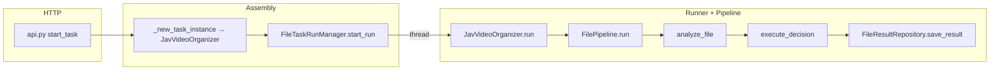

# 架构设计文档

本文档面向 **后续接手的开发者与 AI Agent**：用最少上下文说明 **职责边界、依赖方向、一次任务从 HTTP 到磁盘的完整链路**，以及 **该改哪几个文件**。细节实现以源码与 docstring 为准。

---

## 1. 项目是什么

- **形态**：单进程 HTTP 服务（FastAPI + uvicorn），默认 Docker 部署；宿主机挂载 **`/data`**（应用状态）与 **`/media`**（媒体树）。
- **当前主业务**：`jav_video_organizer` 任务从配置的 **`inbox_dir`**（默认 **`/media/jav_workspace/inbox`**）扫描文件 → 番号/扩展名等规则分析 → 移动/删除/跳过 → 结果写入 SQLite；配置在 YAML，可选 **dry_run** 预览。**逐步说明（分析顺序、番号规则、执行与落库）见 [JAV_VIDEO_PROCESSING_PIPELINE.md](./JAV_VIDEO_PROCESSING_PIPELINE.md)。**
- **附属能力**：`/api/media` 下对 **`MEDIA_ROOT`（`/media`）** 的目录懒加载列举（与整理任务解耦）。

依赖与版本以仓库根目录 **`pyproject.toml`** 为准。

---

## 2. 分层与依赖规则（必读）

采用 **按领域分包**，领域内再分 **`domain`（模型、协议、异常）** 与 **`application`（用例、管道、纯函数编排）**；**`infrastructure`** 实现 **`domain/ports`** 中的 Protocol；**`api`** 只做 **Composition Root + HTTP**，不写业务分支逻辑。

```text
api/                    # FastAPI 工厂、lifespan、路由注册、全局异常映射；AppState 组装
  └── app_state.py      # 唯一集中装配：SQLite、YAML 仓储、FileTaskRunManager、路径

app/<domain>/           # 业务：domain + application；禁止 import infrastructure
shared/                 # 无业务语义：MEDIA_ROOT、文件/日志工具
infrastructure/         # 实现 ports：SQLite、YAML、FileTaskRunManager
```

**合法依赖方向**

- `app/*/domain` → `shared` only  
- `app/*/application` → `shared` + 本领域 `domain`  
- `infrastructure` → `shared` + `app`（实现 ports、调用领域类型）  
- `api` → 全部（组装根）

---

## 3. 目录结构（与源码一致）

```text
src/j_file_kit/
├── main.py                         # CLI：argparse + uvicorn.run(create_app())
├── api/
│   ├── app.py                      # create_app()、lifespan、健康检查、领域异常 → JSON
│   └── app_state.py                # AppState：仓储 + FileTaskRunManager
├── app/
│   ├── file_task/
│   │   ├── api.py                  # POST /api/tasks/{task_type}/start 等
│   │   ├── config_api.py           # 任务配置 CRUD/校验
│   │   ├── domain/
│   │   │   ├── models.py           # TaskConfig、FileTaskRunner Protocol、FileTaskRunStatistics…
│   │   │   ├── decisions.py        # Move/Delete/Skip + FileItemData
│   │   │   ├── ports.py            # FileTaskRunRepository、FileResultRepository、TaskConfigRepository
│   │   │   ├── constants.py        # TASK_TYPE_JAV_VIDEO_ORGANIZER 等
│   │   │   └── jav_organizer_defaults.py  # JAV 管线默认扩展名、站标去噪、misc 删除扩展名
│   │   └── application/
│   │       ├── jav_video_organizer.py   # JavVideoOrganizer：组装 FilePipeline（FileTaskRunner 实现）
│   │       ├── pipeline.py         # FilePipeline：扫描 → analyze → execute → 落库
│   │       ├── analyzer.py         # analyze_file → Decision
│   │       ├── executor.py         # execute_decision
│   │       ├── config.py           # JavVideoOrganizeConfig、AnalyzeConfig
│   │       ├── file_task_config_service.py
│   │       ├── config_validator.py、config_schemas.py、schemas.py
│   │       ├── file_ops.py、jav_filename_util.py
│   └── media_browser/
│       ├── api.py                  # /api/media 下列举子目录
│       └── schemas.py
├── shared/
│   ├── constants.py                # MEDIA_ROOT = Path("/media")
│   └── utils/                      # logging、file_utils …
└── infrastructure/
    ├── file_task/
    │   └── file_task_run_manager.py    # 后台线程执行 task.run()、取消、崩溃恢复
    └── persistence/
        ├── sqlite/…                  # 连接、schema、FileTaskRun / FileResult 仓储实现
        └── yaml/…                    # task_config.yaml、默认配置初始化
```

`tests/` **镜像** `src/j_file_kit/`，用 **pytest marker**（`unit` / `integration` / `e2e`）区分；`conftest.py` 分层继承。

---

## 4. 运行时目录与环境变量

### 4.1 容器内路径

```text
{J_FILE_KIT_BASE_DIR}/              # 默认 /data
├── config/task_config.yaml         # 各 task_type 的配置（TaskConfig 序列化）
├── sqlite/j_file_kit.db
└── logs/{run_name}_{run_id}.jsonl
```

**媒体树**（与 YAML 中目录字段对应）：挂载到 **`/media`**，JAV 整理任务的业务目录在 **`/media/jav_workspace`** 下，如 `jav_workspace/inbox`、`jav_workspace/sorted`、`jav_workspace/unsorted` 等；**JAV 任务配置中的媒体路径必须为 `JAV_MEDIA_ROOT`（`/media/jav_workspace`）子路径**（Pydantic 校验）。

### 4.2 关键环境变量（AI 排错常用）

| 变量 | 作用 |
|------|------|
| `J_FILE_KIT_BASE_DIR` | 应用数据根目录，默认 `/data` |
| `J_FILE_KIT_ENV` | `production` 时启动会校验 **`/media` 是否为挂载点**（未挂载直接失败） |
| `APP_VERSION` | 展示用版本号，默认 `dev` |

---

## 5. 启动顺序（`lifespan`）

1. 日志初始化。  
2. **Production**：若 **`/media` 不是 mount** → `RuntimeError`（防止未映射卷误跑）。  
3. 创建 `sqlite/`、`logs/`、`config/`。  
4. **SQLite**：连接 + `SQLiteSchemaInitializer` 建表。  
5. **YAML**：若缺省则 `DefaultFileTaskConfigInitializer` 写入默认 `jav_video_organizer` 配置。  
6. 构造 **`AppState`**（连接、三套仓储、`FileTaskRunManager`）。  
7. 若存在 JAV 任务配置，**`FileTaskConfigService.get_jav_video_organizer_config`** 做一次校验；失败则 **拒绝启动**。

HTTP 路由：`/health`；任务：`/api/tasks`；配置：`config_api` 注册的前缀；媒体：`/api/media`。OpenAPI 默认 **`/docs`**（部署映射端口以 Docker/平台为准）。

---

## 6. 任务执行链路（从 API 到磁盘）

JAV 整理链路的**字段级与分支级说明**（`analyze_file` 顺序、番号、`dry_run`）见 **[JAV_VIDEO_PROCESSING_PIPELINE.md](./JAV_VIDEO_PROCESSING_PIPELINE.md)**；本节为全局骨架。

### 6.1 文字版（与改代码强相关）

1. **HTTP** `POST /api/tasks/{task_type}/start`（见 `app/file_task/api.py`）。  
2. **`_new_task_instance`**：按 `task_type` 构造 **`FileTaskRunner`** 实现（目前仅 **`JavVideoOrganizer`**），注入 **`TaskConfig`（YAML）**、**`log_dir`**、**`FileResultRepository`**。  
3. **`FileTaskRunManager.start_run`**：写 **`file_task_runs`** 为 PENDING → 起 **守护线程** 调 **`task.run(run_id, dry_run, cancellation_event)`**。  
4. **`JavVideoOrganizer.run`**：校验 **`inbox_dir`** → **`AnalyzeConfig`** → **`FilePipeline.run`**。  
5. **`FilePipeline`**：**深度优先**遍历 `scan_root` → 每文件 **`analyze_file`** → **`execute_decision`**（dry_run 时执行器仍为预览路径）→ **`save_result`**；收尾 **`get_statistics`** → **`FileTaskRunStatistics`**。  
6. **Manager** 根据是否正常结束 / 取消 / 异常，更新 **`file_task_runs`** 状态，并把 **`statistics`** 写入 run 记录。

### 6.2 流程图



### 6.3 并发与调度（易误解点）

- **`FileTaskRunManager` 保证同一时刻只有一个「活跃执行流」**：启动前查库中是否已有 **`RUNNING`**；且内存中跟踪当前 **`run_id`** 与 **`cancellation_event`**。  
- **不区分 `task_type`**：在引入第二个任务类型后，仍是 **全局互斥**（一次只能跑一个 run，与类型无关）。若需并行，需改 **`FileTaskRunManager` / 仓储查询** 策略。  
- **崩溃恢复**：进程启动时将遗留 **PENDING/RUNNING** 标为 **FAILED**（见 **`_recover_from_crash`**）。

---

## 7. 核心类型与职责速查

| 名称 | 位置 | 说明 |
|------|------|------|
| `FileTaskRunner` | `domain/models.py` | Protocol：`task_type` + `run(...)` |
| `JavVideoOrganizer` | `application/jav_video_organizer.py` | 把 `JavVideoOrganizeConfig` 接到 `FilePipeline` |
| `FilePipeline` | `application/pipeline.py` | 扫描 → Decision → 执行 → 每文件入库 |
| `analyze_file` | `application/analyzer.py` | 纯函数；收件箱预删规则 → 扩展名分类 → 番号等 |
| `execute_decision` | `application/executor.py` | 落地移动/删除；配合 dry_run |
| `jav_organizer_defaults` | `domain/jav_organizer_defaults.py` | JAV 内置扩展名分类、misc 删除扩展名、站标去噪（不经 YAML；由 `JavVideoOrganizer` 写入 `AnalyzeConfig`） |
| `TaskConfig` / `JavVideoOrganizeConfig` | `domain/models` + `application/config.py` | YAML dict → 强类型；含 **`JAV_MEDIA_ROOT`（`/media/jav_workspace`）** 目录约束 |
| `FileResultRepository` | `domain/ports.py` + sqlite 实现 | 按 **run_id** 存文件级结果；收尾聚合成统计 |

**Decision 模式**：`MoveDecision` / `DeleteDecision` / `SkipDecision`，分析阶段与执行阶段分离，便于 dry_run。

---

## 8. AI 快速定位：「我要改 X」

| 目标 | 优先打开的模块 |
|------|----------------|
| 新 HTTP 行为或路由前缀 | `api/app.py`、各 `app/*/api.py` |
| 新任务类型或装配注入 | `domain/constants.py`、`application/*` 新 Runner、`api.py` 的 `_new_task_instance`、`app_state.py` 若需新 Bean |
| 扫描/分析/移动规则 | `analyzer.py`、`executor.py`、`jav_filename_util.py` |
| 默认扩展名 / 站标去噪 | `domain/jav_organizer_defaults.py`、`jav_video_organizer._create_analyze_config` |
| 配置字段与校验 | `application/config.py`、`config_validator.py`、`FileTaskConfigService` |
| 任务并发、取消、run 状态机 | `file_task_run_manager.py`、`file_task_run_repository.py` |
| 文件结果与统计 SQL | `file_result_repository.py` |
| 媒体路径、日志、目录工具 | `shared/constants.py`（`MEDIA_ROOT`）、`application/config.py`（如 `JAV_MEDIA_ROOT`）、`shared/utils/` |

---

## 9. 扩展指南

### 9.1 添加任务类型

1. `domain/constants.py`：`TASK_TYPE_*`。  
2. `application/config.py`（及相关 validator / default factory）：新建 **配置 Pydantic 模型**。  
3. 实现 **`FileTaskRunner`**（通常内部复用或仿照 **`FilePipeline`**）。  
4. `file_task/api.py`：**`_new_task_instance`** 增加分支；必要时 **`config_api`** 暴露配置。  
5. 默认 YAML：`create_app` lifespan 或 **`DefaultFileTaskConfigInitializer`** 的默认列表。  

### 9.2 添加新领域（非 file_task）

1. `app/<name>/domain` + `application`。  
2. `api/app.py`：`include_router`。  
3. `AppState`：若需持久化，增加 **ports + infrastructure 实现** 并注入。

---

## 10. 测试

| Marker | 用途 |
|--------|------|
| `@pytest.mark.unit` | 纯函数、模型、无 I/O |
| `@pytest.mark.integration` | SQLite/YAML/HTTP |
| `@pytest.mark.e2e` | 真实 Docker 场景 |

常用命令见仓库根 **`justfile`** / **`README.md`**。

---

## 11. 常见陷阱（给 AI）

- **路径**：JAV 任务配置里出现的目录必须落在 **`/media/jav_workspace` 下**（`JAV_MEDIA_ROOT`）；否则构造 **`JavVideoOrganizeConfig` 即失败**。未来新增 organizer 各自在 config 模块定义同级根目录（如 `XXX_MEDIA_ROOT = MEDIA_ROOT / "xxx"`）。  
- **统计**：任务结束展示/持久化的汇总统计以仓储 **`get_statistics`** 与 **`FileTaskRunStatistics`** 为准，勿与 pipeline 内仅用于日志的内存计数混淆。  
- **生产启动**：未挂载 **`/media`** 会直接 **`RuntimeError`**，属预期防护。  

更细的模块级说明见各文件 **模块 docstring** 与 **类注释**（尤其 `jav_video_organizer.py`、`pipeline.py`、`config.py`、`ports.py`）。
