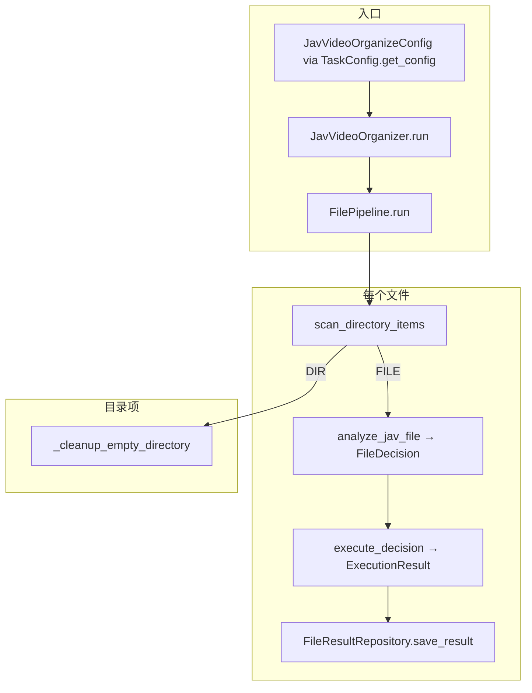

# JAV 媒体整理处理流程（详细说明）

本文档描述 **`jav_video_organizer` 任务**从配置到磁盘落地的完整链路，是项目当前最核心的业务流程。实现分散在 `application/` 与 `domain/` 中，阅读时可对照下文的**源码索引**跳转。

总体架构总览见 [ARCHITECTURE.md](./ARCHITECTURE.md)。

---

## 1. 流程总览

任务类型常量：`TASK_TYPE_JAV_VIDEO_ORGANIZER`（`domain/constants.py`）。

核心设计：**分析（纯函数）与执行（副作用）分离**，中间用 **Decision** 衔接；支持 **`dry_run`** 只生成预览结果、不写真实移动/删除（executor 仍返回 `PREVIEW` 状态）。

---

## 2. 配置如何进入流水线

| 层次 | 类型 | 说明 |
|------|------|------|
| 存储 | `TaskConfig` | YAML 中一条记录：`type` + `enabled` + `config`（dict） |
| 任务强类型 | `JavVideoOrganizeConfig` | `get_config(JavVideoOrganizeConfig)`；含 **`inbox_dir`**、各输出目录、收件箱预删、`misc_file_delete_rules` 可调片段（max_size）等 |
| 分析专用 | `JavAnalyzeConfig` | `JavVideoOrganizer` 内由 `_create_analyze_config()` 组装：**四类扩展名**、**站标去噪子串**、**misc 删除扩展名**来自 **`domain/organizer_defaults.py`**，并与 YAML 中的目录、`misc_file_delete_rules`（无 extensions）、收件箱预删等合并；**不含** `inbox_dir`，专供 **`analyze_jav_file`** |

路径不变量：配置中凡出现的媒体目录须在 **`JAV_MEDIA_ROOT`（`/media/jav_workspace`）** 下，由 Pydantic 校验（见 `JavVideoOrganizeConfig.validate_dir_paths_under_media_root`）。

**`JavVideoOrganizer.run`**（`jav_video_organizer.py`）要点：

1. `inbox_dir` 为 `None` → `ValueError`。  
2. 构造 `JavAnalyzeConfig`。  
3. 实例化 `FilePipeline`：`scan_root = inbox_dir`，`analyze_config`、`run_id`、`log_dir`、`file_result_repository` 注入。  
4. 返回 `pipeline.run(dry_run=..., cancellation_event=...)`。

---

## 3. 目录扫描：`FilePipeline` + `scan_directory_items`

**文件**：`application/pipeline.py`（编排）、`application/file_ops.py`、`application/pipeline_item_processor.py`、`application/pipeline_directory_cleanup.py`。

- **遍历根**：`scan_root` 即收件箱 **`inbox_dir`**。  
- **顺序**：`os.walk(..., topdown=False)` **自底向上**：先子目录内文件，再子目录，再父目录。意图是：文件先被移走/删掉后，空目录可在后续步骤被删掉。  
- **对每个 FILE**：`process_single_file_for_run`（`pipeline_item_processor`）。  
- **对每个 DIRECTORY**（含根以下的目录节点）：`cleanup_empty_directory_under_scan`——**非** `dry_run`、且不是 `scan_root` 本身时，尝试删除空目录（见 `delete_directory_if_empty`）。

**取消**：在「每个路径项」之间检查 `cancellation_event`；置位后记录日志并跳出循环，再进入 `finish_task_with_repository_statistics`。

---

## 4. 单文件分析：`analyze_jav_file`

**文件**：`application/jav_analyzer.py`。  
**入口函数**：**`analyze_jav_file`**。  
**性质**：**纯函数**，不读写磁盘（除预删除规则里可能 `stat` 体积）。  
**返回**：`FileDecision` = `MoveDecision | DeleteDecision | SkipDecision`（定义见 `domain/decisions.py`）。

### 4.1 总顺序（必须记住）

1. **收件箱预删除**（`_check_inbox_delete_rules`）——在 **扩展名分类之前**。  
2. **按扩展名分类**（`_classify_file`）→ `FileType`。  
3. 按类型分支：  
   - `MISC` → `_decide_misc_action`  
   - `ARCHIVE` → `_decide_archive_action`  
   - `VIDEO` / `IMAGE` / `SUBTITLE` → `_decide_media_action`

### 4.2 收件箱预删除（`InboxDeleteRules`）

- **语义**：任一条件满足即删除（OR）。  
- **评估顺序**（为少打盘）：`stem` **完全匹配** `exact_stems` → `stem` **包含**任一默认垃圾关键词（`DEFAULT_PROBABLE_JUNK_MEDIA_KEYWORDS`）→ 若配置了 `max_size_bytes`，则 **`stat`，大小 ≤ 阈值**（含 0 可表示「空/极小文件」等用法，以配置为准）。  
- 命中 → `DeleteDecision`，`file_type=UNCLASSIFIED`。

### 4.3 扩展名分类（`_classify_file`）

按 `JavAnalyzeConfig` 中四类集合：**video / image / subtitle / archive** 扩展名来自 **`organizer_defaults`**（已规范为带点；匹配时用小写比较）；均不匹配 → **`MISC`**。

### 4.4 Misc（`_decide_misc_action`）

1. `_check_misc_delete_rules`：`misc_file_delete_rules` 字典——**扩展名列表**由代码常量注入（**优先级最高**）；若配置了 `max_size`，则再按体积阈值删除。旧 YAML 若含 `extensions` / `keywords` 键会在加载 `JavVideoOrganizeConfig` 时被剔除且不写回。  
2. 命中删除 → `DeleteDecision`。  
3. 否则若 **`misc_dir` 未设置** → `SkipDecision`。  
4. 否则 → **`MoveDecision`** 到 `misc_dir / 原文件名`（经 `sanitize_surrogate_str`）。

### 4.5 压缩包（`_decide_archive_action`）

- **`archive_dir` 未设置** → `SkipDecision`。  
- 否则 → `MoveDecision` 到 `archive_dir / 文件名`。

### 4.6 视频 / 图片 / 字幕（`_decide_media_action`）

对 **VIDEO** 且配置了 **`video_small_delete_bytes`**：先 **体积** 严格小于阈值 → **直接 `DeleteDecision`**（不解析番号）。

否则进入 **番号与重构文件名**逻辑：

1. `sanitize_surrogate_str(path.name)` 得到安全文件名。  
2. **`generate_jav_filename(safe_name, strip_substrings=...)`**（`jav_filename_util.py`）：  
   - 先按 **`JavAnalyzeConfig.jav_filename_strip_substrings`**（管线从 **`organizer_defaults`** 注入）做站标去噪（大小写不敏感）；  
   - 再滑动匹配番号（见第 5 节）；  
   - 返回 **`(new_filename, serial_id)`**；无番号时 **`(原 filename, None)`**（未匹配番号时**不做**去噪输出，与有番号路径不同）。

3. **有番号**（`serial_id` 非空）：  
   - **`sorted_dir` 未设置** → `SkipDecision`。  
   - 否则目标目录：`sorted_dir / generate_sorted_dir(serial_id) / new_filename`（见第 5.2 节）→ **`MoveDecision`**（带 `serial_id`）。

4. **无番号**：  
   - **IMAGE** → **`DeleteDecision`**（图片无番号直接删）。  
   - **VIDEO / SUBTITLE**：**`unsorted_dir` 未设置** → `SkipDecision`；否则 → **`MoveDecision`** 到 `unsorted_dir / safe_name`（**不**用 `new_filename` 路径逻辑，见源码：无番号用 `safe_name`）。

---

## 5. 番号、文件名与 sorted 子目录

**文件**：`application/jav_filename_util.py`、`domain/serial_id.py`（`SerialId`、数字有效性）。

### 5.1 匹配规则（摘要）

- 配置中**不**包含番号正则；模块内固定 **`JAV_SERIAL_PREFIX_PATTERN`**：字母前缀 2–6 位，后与数字间可有 `-`/`_`，再跟 **3–5 位数字**，且满足领域 **`serial_number_raw_is_valid`**（与 `SerialId` 一致）。  
- **滑动重试**：避免误吞过长数字段。  
- 输出标准番号形式由 **`SerialId`** 规范化（如 `PREFIX-NUMBER`）。

### 5.2 `generate_jav_filename`

- 去噪后的串上找番号，按业务规则 **trim** 第 1/3 段、拼接新文件名；超长时 **截断非关键段**，番号与扩展名等关键部分保留（见模块顶部长注释）。  
- 成功时返回 **`new_filename`**（可能已重构）和 **`SerialId`**。

### 5.3 `generate_sorted_dir(serial_id)`

- 返回相对路径：**`首字母 / 前两字母 / 完整前缀`**，例如番号前缀 `ABCD` → `A/AB/ABCD`。  
- 与 **`sorted_dir`** 拼接：`sorted_dir / generate_sorted_dir(serial_id) / new_filename`。

---

## 6. 执行：`execute_decision`

**文件**：`application/executor.py`。

| `dry_run` | 行为 |
|-----------|------|
| `True` | 不创建目录、不移动、不删除；对每个 Decision 构造 **`ExecutionResult.preview`**，`status=PREVIEW`，消息描述拟议操作。 |
| `False` | 按 Decision 类型执行 |

| Decision | 实际 I/O |
|----------|----------|
| `MoveDecision` | `ensure_directory(target.parent, parents=True)` → **`move_file_with_conflict_resolution`**（目标存在则生成 `-jfk-xxxx` 候选名重试，最多 10 次） |
| `DeleteDecision` | **`delete_file_if_exists`** |
| `SkipDecision` | 无 I/O；`ExecutionResult.skipped` |

失败时返回 **`ExecutionResult.error`**，携带异常信息字符串（移动/删除各自 try/except）。

---

## 7. pipeline 内：结果落库与收尾统计

**文件**：`application/pipeline.py`（编排）、`application/pipeline_item_processor.py`、`application/pipeline_result_mapper.py`、`application/pipeline_observer.py`。

对每个文件：

1. `analyze_jav_file` → `execute_decision`。  
2. **`build_file_item_data`** 组装 **`FileItemData`**（决策类型、目标路径、成功与否、`duration_ms` 等）。  
3. **`file_result_repository.save_result(run_id, item_data)`**。  
4. **`PipelineRunCounters.apply_execution_result`**、结构化 **`ITEM_RESULT` 日志**（`pipeline_observer`）。  
5. 若 `analyze_jav_file`～`execute_decision` **整段抛异常**：写一条 **`decision_type=error`** 的 `FileItemData`，仍 `save_result`；内存侧 **`record_file_processing_exception`**。

**收尾**：**`finish_task_with_repository_statistics`** 调用 **`get_statistics(run_id)`**（SQLite 聚合），校验为 **`FileTaskRunStatistics`** 返回上层；任务级开始/结束另有 **`TASK_START` / `TASK_END`** 日志。

**重要**：对外展示的汇总统计以 **仓储聚合** 为准；管道对象上另有内存计数，用途与日志一致，不要与 DB 混用含义。

---

## 8. HTTP 侧与执行线程（上下文）

- API 通过 **`FileTaskRunManager.start_run`** 在**后台线程**调用 **`FileTaskRunner.run`**。  
- 同进程**全局同一时间通常只跑一个 run**（见 `FileTaskRunManager` 与库中 `RUNNING` 检查）。  
- **`run` 完成后**：Manager 将 **`FileTaskRunStatistics`** 写入 **`file_task_runs`** 记录。

（HTTP 路由细节见 `app/file_task/api.py`，非本子文档重点。）

---

## 9. 源码索引（按阅读顺序）

| 顺序 | 模块 | 作用 |
|------|------|------|
| 1 | `application/jav_video_organizer.py` | 配置 → `FilePipeline` |
| 2 | `application/pipeline.py` | 扫描循环、单文件处理、收尾统计 |
| 3 | `application/jav_analyzer.py` | `analyze_jav_file` 全部分支 |
| 4 | `application/jav_filename_util.py` | 番号匹配、文件名重构、`generate_sorted_dir` |
| 5 | `application/executor.py` | `execute_decision`、dry_run |
| 6 | `application/file_ops.py` | `scan_directory_items`、移动冲突消解 |
| 7 | `domain/decisions.py` | Decision / `FileItemData` |
| 8 | `domain/organizer_defaults.py` | 共享默认扩展名、JAV 站标去噪、misc 删除扩展名 |
| 9 | `application/jav_task_config.py`、`application/jav_analyze_config.py`、`application/config_common.py` | `JavVideoOrganizeConfig`、`JavAnalyzeConfig`、`InboxDeleteRules` 等 |
| 10 | `infrastructure/persistence/sqlite/file_task/file_result_repository.py` | 落库与聚合（实现 `FileResultRepository`） |

---

## 10. 调试与排错提示

- **整批跳过移动**：检查 **`sorted_dir` / `unsorted_dir` / `misc_dir` / `archive_dir`** 是否在 YAML 中配置且通过校验。  
- **番号总匹配失败**：对照 **`organizer_defaults`** 中的站标去噪子串与 **`JAV_SERIAL_PREFIX_PATTERN` / `SerialId`** 规则；文件名是否含合法前缀+数字段。  
- **预览正常、正式不对**：对比 **`dry_run`** 分支是否仅跳过真实 I/O；正式路径下看 executor 返回的 **`message`** 与 DB 中 **`error_message`**。  
- **空目录没删**：非 dry_run 下由 `_cleanup_empty_directory` 处理；根 **`scan_root`** 本身不会被删。

本文档应随业务规则变更同步更新；若与代码冲突，**以源码为准**。
