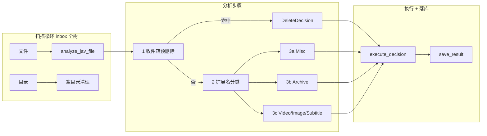

# JAV 媒体整理管线

任务：`TASK_TYPE_JAV_VIDEO_ORGANIZER`。入口 **`JavVideoOrganizer`** → **`FilePipeline.run()`**（[`jav_pipeline/pipeline.py`](../src/j_file_kit/app/file_task/application/jav_pipeline/pipeline.py)）。递归扫描 **`inbox`** 全树：对每个文件执行「分析 → 执行 → 落库」，对每个目录尝试清理空目录；**分析（纯函数）与执行（副作用）通过 Decision 解耦**。计数写入 **`FileTaskRunStatistics`**；与代码冲突时**以源码为准**。

架构总览：[ARCHITECTURE.md](./ARCHITECTURE.md)。

---

## 配置与目录约定

YAML / HTTP PATCH 仅持久化 **`workspace_root`**（须在 **`JAV_MEDIA_ROOT`** `/media/jav_workspace` 下）。**`inbox`、`sorted`、`unsorted`、`archive`、`misc`** 等子目录名由 [`config_common.jav_workspace_paths`](../src/j_file_kit/app/file_task/application/config_common.py) 集中定义；保存配置时会创建 **`workspace_root`** 与 **`inbox`**；任务启动前再次校验 **`inbox`**；`MoveDecision` 执行时目标目录按需 **`mkdir`**。

---

## 总览

---

## 共享口径（各步骤一致）

| 项 | 说明 |
|----|------|
| **junk 关键字** | [`organizer_defaults.py`](../src/j_file_kit/app/file_task/domain/organizer_defaults.py) 中的 `DEFAULT_RAW_JUNK_KEYWORDS`（Raw / JAV 共用）；stem 经 [`name_keyword_match`](../src/j_file_kit/shared/utils/name_keyword_match.py) 匹配：NFKC、大小写无关，且须在 **token 边界**上出现（显式分隔符含 `.` 等 + Unicode `Z*` / `P*`）；`L*`/`N*` 粘连不算边界（详见模块注释）。 |
| **移动命名** | **`move_file_with_conflict_resolution`**（目标存在时追加 `-jfk-xxxx` 重试，最多 10 次）；目标目录由 `ensure_directory(..., parents=True)` 按需创建。 |
| **dry_run** | 不写盘；`execute_decision` 返回 `status=PREVIEW`，携带拟议操作描述；计数与日志仍按「将要发生的动作」累加。 |
| **取消** | `cancellation_event` 置位后：在「每个路径项」之间检查，置位即跳出循环，再进入 `finish_task_with_repository_statistics`。 |
| **空目录清理** | `scan_directory_items` 基于 `os.walk(topdown=False)` 自底向上；遇目录节点（非 `scan_root` 本身、非 dry_run）时调用 `cleanup_empty_directory_under_scan`。 |

---

## 产品常量

所有默认关键字与扩展名集合均定义于 [`organizer_defaults.py`](../src/j_file_kit/app/file_task/domain/organizer_defaults.py)，由 `JavVideoOrganizer._create_analyze_config` 注入 `JavAnalyzeConfig`。四类媒体扩展名集合（video / image / subtitle / archive）与 music / misc_delete 共六组，启动时校验两两互斥。

---

## 扫描循环

**代码**：[`jav_pipeline/pipeline.py`](../src/j_file_kit/app/file_task/application/jav_pipeline/pipeline.py) · `FilePipeline.run()`

**范围**：`inbox` 全树（`scan_directory_items` 基于 `os.walk(topdown=False)` 自底向上）。

**对每个 FILE**：`process_single_file_for_run`（[`item_processor.py`](../src/j_file_kit/app/file_task/application/jav_pipeline/item_processor.py)）→ `analyze_jav_file` → `execute_decision` → `save_result`；整段抛异常时写 `decision_type=error` 记录，仍落库。

**对每个 DIRECTORY**：`cleanup_empty_directory_under_scan`（[`directory_cleanup.py`](../src/j_file_kit/app/file_task/application/jav_pipeline/directory_cleanup.py)）——非 dry_run 且非 `scan_root` 本身时尝试删除空目录。

---

## 分析 — `analyze_jav_file`

**代码**：[`jav_analysis/runner.py`](../src/j_file_kit/app/file_task/application/jav_analysis/runner.py) · `analyze_jav_file()`

**性质**：**纯函数**，不产生磁盘副作用（规则内可能 `stat` 体积）。返回 `FileDecision` = `MoveDecision | DeleteDecision | SkipDecision`（[`domain/decisions.py`](../src/j_file_kit/app/file_task/domain/decisions.py)）。

**严格按步骤 1 → 2 → 3 顺序**执行；前步命中后不再进入后续步骤。

---

### 步骤 1 — 收件箱预删除

**代码**：[`jav_analysis/inbox.py`](../src/j_file_kit/app/file_task/application/jav_analysis/inbox.py) · `check_inbox_delete_rules()`

**匹配规则（OR，评估顺序如下以减少磁盘访问）**：

| 顺序 | 规则 | 条件 |
|------|------|------|
| 1 | stem 完全匹配 | `stem ∈ InboxDeleteRules.exact_stems` |
| 2 | stem junk 关键字 | stem token 边界命中 `DEFAULT_RAW_JUNK_KEYWORDS` |
| 3 | 体积上限（若配置） | `st_size ≤ InboxDeleteRules.max_size_bytes`（含 0）；`stat` 失败则跳过不删 |

**动作**：命中任一 → `DeleteDecision`（`file_type=UNCLASSIFIED`）。

> 此步骤在**扩展名分类之前**，任何类型的文件均参与评估。

---

### 步骤 2 — 扩展名分类

**代码**：[`jav_analysis/classify.py`](../src/j_file_kit/app/file_task/application/jav_analysis/classify.py) · `classify_jav_file()`

`suffix.lower()` 依次对照 `video_extensions` / `image_extensions` / `subtitle_extensions` / `archive_extensions`（`JavAnalyzeConfig` 注入）；均不命中 → `MISC`。

---

### 步骤 3a — Misc

**代码**：[`jav_analysis/misc.py`](../src/j_file_kit/app/file_task/application/jav_analysis/misc.py) · `decide_misc_action()`

**删除规则（命中即删，OR 语义）**：

| 顺序 | 规则 | 条件 | 体积限制 |
|------|------|------|----------|
| 1 | 扩展名列表 | `suffix ∈ misc_file_delete_rules.extensions` | 无 |
| 2 | 体积上限（若配置） | `st_size ≤ max_size`；`stat` 失败则跳过不删 | 以 `max_size` 为准 |

**动作**：命中删除 → `DeleteDecision`；否则 → `MoveDecision` 到 `misc_dir / 原文件名`。

---

### 步骤 3b — Archive

**代码**：[`jav_analysis/archive.py`](../src/j_file_kit/app/file_task/application/jav_analysis/archive.py) · `decide_archive_action()`

**动作**：直接 `MoveDecision` 到 `archive_dir / 原文件名`。

---

### 步骤 3c — Video / Image / Subtitle

**代码**：[`jav_analysis/media.py`](../src/j_file_kit/app/file_task/application/jav_analysis/media.py) · `decide_media_action()`

**小体积视频前置删除**（仅 VIDEO，须配置 `video_small_delete_bytes`）：`st_size < video_small_delete_bytes` → `DeleteDecision`；`stat` 失败则跳过继续走番号逻辑。

**决策分支**：

| 条件 | 决策 |
|------|------|
| `serial_id` 非空 | `MoveDecision` → `sorted_dir / generate_sorted_dir(serial_id) / new_filename` |
| 无 `serial_id` + IMAGE | `DeleteDecision`（图片无番号直接删） |
| 无 `serial_id` + VIDEO / SUBTITLE | `MoveDecision` → `unsorted_dir / safe_name` |

---

## 番号与文件名

**代码**：[`application/jav_filename_util.py`](../src/j_file_kit/app/file_task/application/jav_filename_util.py)；`SerialId` / 有效性校验见 [`domain/serial_id.py`](../src/j_file_kit/app/file_task/domain/serial_id.py)

**站标去噪**：`generate_jav_filename` 先按 `JavAnalyzeConfig.jav_filename_strip_substrings`（`DEFAULT_JAV_FILENAME_STRIP_SUBSTRINGS`）做大小写不敏感全局替换；有番号时输出文件名同样不含这些子串；无番号时不做去噪输出。

**番号匹配**：固定 `JAV_SERIAL_PREFIX_PATTERN`——字母前缀 2–6 位，后与数字间可有 `-`/`_`，再跟 3–5 位数字，且满足 `serial_number_raw_is_valid`；支持滑动重试以避免误吞过长数字段。

**sorted 子目录结构**：`generate_sorted_dir(serial_id)` 返回 **`首字母 / 前两字母 / 完整前缀`**，例如前缀 `ABCD` → `A/AB/ABCD`。

**超长文件名截断**：重构后文件名超出 `MAX_FILENAME_BYTES` 时，按各长段原始字节占比分配预算截断非关键段；番号与扩展名等关键部分保留（见模块顶部注释）。

---

## 执行 — `execute_decision`

**代码**：[`jav_pipeline/executor.py`](../src/j_file_kit/app/file_task/application/jav_pipeline/executor.py) · `execute_decision()`

| `dry_run` | 行为 |
|-----------|------|
| `True` | 不创建目录、不移动、不删除；返回 `ExecutionResult.preview`（`status=PREVIEW`）。 |
| `False` | 按 Decision 类型执行 |

| Decision | 实际 I/O |
|----------|----------|
| `MoveDecision` | `ensure_directory(target.parent)` → `move_file_with_conflict_resolution` |
| `DeleteDecision` | `delete_file_if_exists` |
| `SkipDecision` | 无 I/O；返回 `ExecutionResult.skipped` |

失败时返回 `ExecutionResult.error`，携带异常信息字符串。

---

## 结果落库与统计

**代码**：[`jav_pipeline/item_processor.py`](../src/j_file_kit/app/file_task/application/jav_pipeline/item_processor.py) · [`result_mapper.py`](../src/j_file_kit/app/file_task/application/jav_pipeline/result_mapper.py) · [`observer.py`](../src/j_file_kit/app/file_task/application/jav_pipeline/observer.py)

对每个文件：

1. `build_file_item_data`：组装 `FileItemData`（决策类型、目标路径、成功与否、`duration_ms` 等）。
2. `file_result_repository.save_result(run_id, item_data)`。
3. `PipelineRunCounters.apply_execution_result` + 结构化 `ITEM_RESULT` 日志。
4. 整段抛异常 → 写 `decision_type=error` 的 `FileItemData`，仍 `save_result`。

**收尾**：`finish_task_with_repository_statistics` 调 `get_statistics(run_id)`（SQLite 聚合）校验为 `FileTaskRunStatistics` 返回上层；任务级另有 `TASK_START` / `TASK_END` 日志。

> 对外展示的汇总统计以**仓储聚合**为准；管道对象上的内存计数仅用于日志，不与 DB 混用含义。

---

## 计数字段语义

完整字段语义：[`domain/task_run.py`](../src/j_file_kit/app/file_task/domain/task_run.py)。
