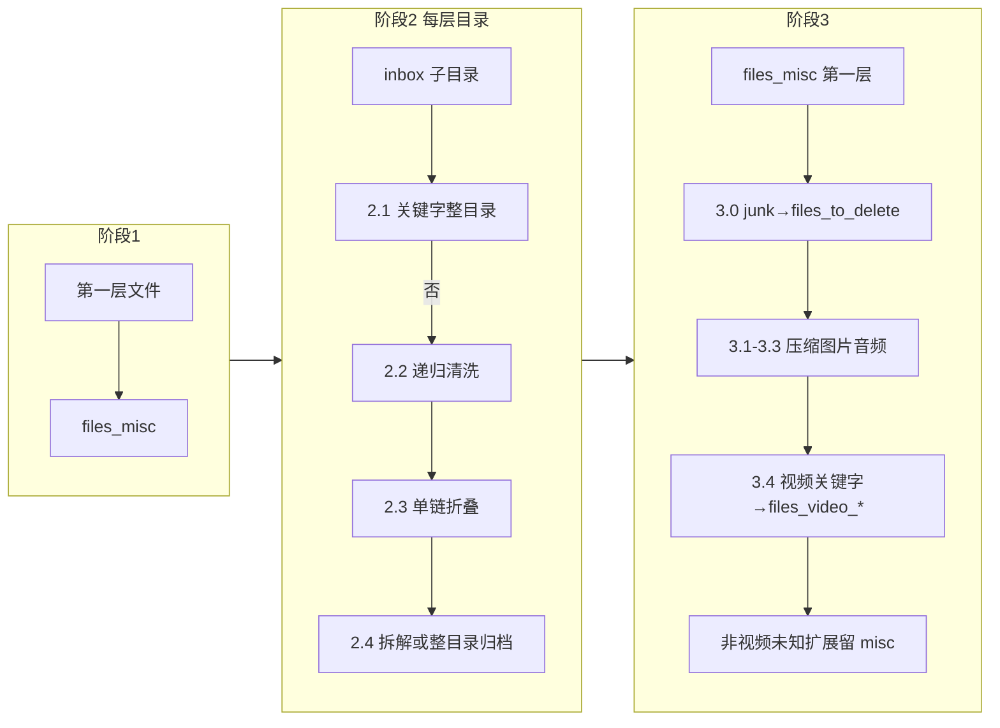

# Raw 媒体整理管线

任务：`TASK_TYPE_RAW_FILE_ORGANIZER`。入口 **`RawFileOrganizer`** → **`RawFilePipeline.run()`**（[`pipeline.py`](../src/j_file_kit/app/file_task/application/raw_pipeline/pipeline.py)）。仅处理 **`scan_root`（inbox）第一层**：散落文件、第一层子目录；**不递归 inbox 下的多级散落文件**（阶段 1）。计数写入 **`FileTaskRunStatistics`**；与代码冲突时**以源码为准**。

---

## 配置与目录约定

YAML / HTTP PATCH 仅持久化 **`workspace_root`**（须在 **`RAW_MEDIA_ROOT`** `/media/raw_workspace` 下）。**`inbox`、`files_misc`、`folders_*`、`files_*`** 等子目录名由 [`config_common.raw_workspace_paths`](../src/j_file_kit/app/file_task/application/config_common.py) 集中定义；保存配置时会创建 **`workspace_root`** 与 **`inbox`**；任务启动前再次校验 **`inbox`**；管线内目标目录在移动前按需 **`mkdir`**。

---

## 总览

---

## 共享口径（各阶段一致）

| 项 | 说明 |
|----|------|
| **junk / 视频桶关键字** | [`organizer_defaults.DEFAULT_RAW_JUNK_KEYWORDS`](../src/j_file_kit/app/file_task/domain/organizer_defaults.py) 等；目录名 / stem 经 [`name_keyword_match`](../src/j_file_kit/shared/utils/name_keyword_match.py)：NFKC、大小写无关，且须在 **token 边界**上出现（显式分隔符含 `.` 等 + Unicode ``Z*`` / ``P*``）；``L*``/``N*`` 粘连不算边界（详见模块注释）。 |
| **移动命名** | **`normalize_move_basename`** + **`move_file_with_conflict_resolution`**（`-jfk-xxxx`）；目录整块迁移用 **`move_directory_with_conflict_resolution`**。 |
| **dry_run** | 不写盘；计数与日志仍按「将要发生的动作」累加（细粒度见各阶段源码）。 |
| **取消** | `cancellation_event` 置位后：阶段 1 逐文件、阶段 2 目录边界与 2.2 扫描迭代等处退出（[`pipeline.py`](../src/j_file_kit/app/file_task/application/raw_pipeline/pipeline.py)）。 |

---

## 产品常量（Raw 相关摘录）

| 符号 | 用途 |
|------|------|
| `DEFAULT_RAW_JUNK_KEYWORDS` | 2.1 目录 basename；2.2 / 3.0 文件 stem **token 边界**命中 junk（见共享口径表）。 |
| `DEFAULT_MISC_FILE_DELETE_EXTENSIONS` | 2.2 命中即删（**无体积上限**）。 |
| `DEFAULT_RAW_PHASE22_JUNK_DELETE_MAX_BYTES` | **仅 2.2**：stem **junk 关键字 token 边界命中**时还须 **`st_size` 严格小于**该值（默认 **100MiB**）。 |
| `DEFAULT_RAW_PHASE34_VIDEO_*_KEYWORDS` | **阶段 3.4**：视频 stem **token 边界**关键字（按桶，`jav` 桶可为空元组占位）。 |
| 媒体扩展名集合 | `DEFAULT_*_EXTENSIONS` → 注入 **`RawAnalyzeConfig`**，供 2.4 / 3 分流判定。 |

---

## 阶段简表

| 阶段 | 范围 | 动作摘要 | 涉及目录（均由 `raw_workspace_paths` 派生） |
|------|------|----------|----------------------|
| **1** | inbox 下一层**文件** | 迁入 `files_misc`，写 `file_results` | 有待移文件时 `files_misc` |
| **2.1** | 各第一层**目录** basename | junk 关键字 **token 边界**命中则**整目录**→ `folders_to_delete` | 有待迁目录时 `folders_to_delete` |
| **2.2** | 未迁走的目录**整棵子树** | 删垃圾文件、自下而上删空目录；规则见下节 | — |
| **2.3** | 仍存在的第一层目录 | 多层单链折叠为一层目录名（超长合并名有截断策略） | — |
| **2.4** | 仍存在的第一层目录 | 小目录拆解→`files_misc`；否则按树内类型 **整目录**→ `folders_*` | 有待分类目录时 `files_misc` + 各 `folders_pic` / `audio` / `compressed` / `video` / `misc`（[`phase2_preflight.py`](../src/j_file_kit/app/file_task/application/raw_pipeline/phase2_preflight.py)） |
| **3.0** | `files_misc` **下一层文件** | stem **token 边界** junk → **`files_to_delete`**（无体积条件） | 有待迁出 junk 文件时 `files_to_delete` |
| **3.x** | 同上剩余队列（不含已迁 `files_to_delete`） | 压缩 / 图片 / 音频→ `files_compressed` / `files_pic` / `files_audio`；**视频**按 stem 关键字顺序归入各 **`files_video_*`**（未命中→ **`files_video_misc`**）；**非视频的未知扩展名**仍留 **`files_misc`** | 有待分流类型时对应 `files_*` / `files_video_*` |

**编排**：[`phase2.py`](../src/j_file_kit/app/file_task/application/raw_pipeline/phase2.py)（`phase2_delete_move` / `clean` / `collapse` / `classify`）。

---

## 2.2 删除规则（递归目录内文件）

命中 **任一** 则删除：`misc` 扩展名 **或** stem **token 边界** junk 且 **体积 < `DEFAULT_RAW_PHASE22_JUNK_DELETE_MAX_BYTES`** **或** 0 字节文件。then 删产生的空目录（第一层目录删空则 `rmdir`）。

**对照 3.0**：2.2 在「第一层子目录以内」递归；3.0 只在 **`files_misc` 单层**，junk **token 边界**命中即迁入 `files_to_delete`，**无** 100MiB 门槛。

---

## 2.4 拆分一句话

- **小目录**（仅文件、无子目录、≤5 个文件、类型为单一媒体类或「单一类+图片」）：文件进 **`files_misc`**（命名规则见源码）。
- **否则**：按整棵树扩展名画像迁到某一 **`folders_*`**；unknown 扩展名等混合类型 → **`folders_misc`**。

---

## 阶段 3 计数（近似）

- **`phase3_deleted_junk_misc`**：3.0 迁入 `files_to_delete`（含 dry_run）。
- **`phase3_seen_files_misc`**：3.0 之后参与分流的文件数。
- **`phase3_deferred_files_misc`**：未成功完成阶段 3 分流者（**非视频**的未知扩展仍驻 `files_misc`、迁移失败等；已成功迁入各 `files_*` / `files_video_*` 的视频不计入）。

近似：`3.0 前 misc 第一层文件数 ≈ phase3_seen_files_misc + phase3_deleted_junk_misc`。

完整字段语义：**[`domain/task_run.py`](../src/j_file_kit/app/file_task/domain/task_run.py)**。架构总览：**[ARCHITECTURE.md](./ARCHITECTURE.md)**。
