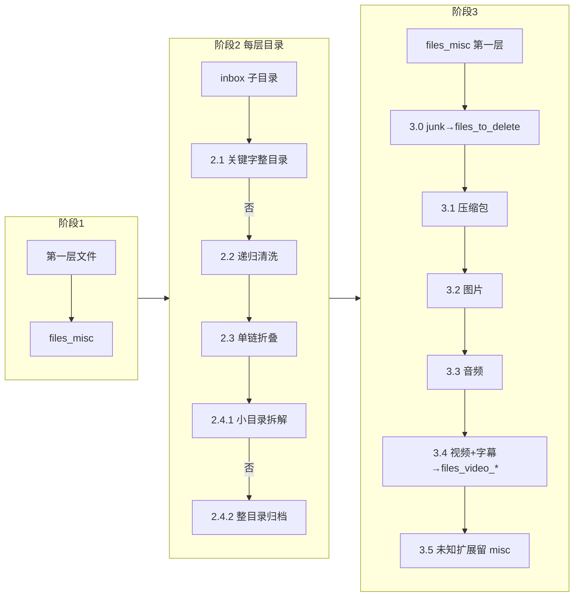

# Raw 媒体整理管线

任务：`TASK_TYPE_RAW_FILE_ORGANIZER`。入口 **`RawFileOrganizer`** → **`RawFilePipeline.run()`**（[`pipeline.py`](../src/j_file_kit/app/file_task/application/raw_pipeline/pipeline.py)）。仅处理 **`scan_root`（inbox）第一层**：散落文件、第一层子目录；**不递归 inbox 下的多级散落文件**（阶段 1）。计数写入 **`FileTaskRunStatistics`**；与代码冲突时**以源码为准**。

---

## 配置与目录约定

YAML / HTTP PATCH 仅持久化 **`workspace_root`**（须在 **`RAW_MEDIA_ROOT`** `/media/raw_workspace` 下）。**`inbox`、`files_misc`、`folders_*`、`files_*`** 等子目录名由 [`config_common.raw_workspace_paths`](../src/j_file_kit/app/file_task/application/config_common.py) 集中定义；保存配置时会创建 **`workspace_root`** 与 **`inbox`**；任务启动前再次校验 **`inbox`**；管线内目标目录在移动前按需 **`mkdir`**。

---

## 总览



---

## 共享口径（各阶段一致）

| 项 | 说明 |
|----|------|
| **junk / 视频桶关键字** | [`organizer_defaults.DEFAULT_RAW_JUNK_KEYWORDS`](../src/j_file_kit/app/file_task/domain/organizer_defaults.py) 等；目录名 / stem 经 [`name_keyword_match`](../src/j_file_kit/shared/utils/name_keyword_match.py)：NFKC、大小写无关，且须在 **token 边界**上出现（显式分隔符含 `.` 等 + Unicode `Z*` / `P*`）；`L*`/`N*` 粘连不算边界（详见模块注释）。 |
| **移动命名** | **`normalize_move_basename`** + **`move_file_with_conflict_resolution`**（`-jfk-xxxx`）；目录整块迁移用 **`move_directory_with_conflict_resolution`**。 |
| **dry_run** | 不写盘；计数与日志仍按「将要发生的动作」累加。 |
| **取消** | `cancellation_event` 置位后：阶段 1 逐文件、阶段 2 目录边界与 2.2 扫描迭代等处退出（[`pipeline.py`](../src/j_file_kit/app/file_task/application/raw_pipeline/pipeline.py)）。 |
| **字幕伴随语义** | 字幕（`subtitle_extensions`）是视频的伴随类型，在 2.4.1 / 2.4.2 / 3.4 中与视频共用目标桶，**不单独设立** `files_subtitle` 目录。 |

---

## 产品常量（Raw 相关摘录）

来源：[`organizer_defaults.py`](../src/j_file_kit/app/file_task/domain/organizer_defaults.py)

| 符号 | 用途 |
|------|------|
| `DEFAULT_RAW_JUNK_KEYWORDS` | 2.1 目录 basename；2.2 / 3.0 文件 stem **token 边界**命中 junk。 |
| `DEFAULT_MISC_FILE_DELETE_EXTENSIONS` | 2.2 命中即删（**无体积上限**）。 |
| `DEFAULT_RAW_CLEANUP_JUNK_MAX_BYTES` | **仅 2.2**：stem junk 命中时须 **`st_size` 严格小于**该值（默认 **100MiB**）才删除。 |
| `DEFAULT_RAW_VIDEO_BUCKET_*_KEYWORDS` | **3.4**：视频/字幕 stem **token 边界**关键字（按桶，`jav` 桶可为空元组占位）。 |
| 媒体扩展名集合 | `DEFAULT_*_EXTENSIONS` → 注入 **`RawAnalyzeConfig`**，供 2.4 / 3 分流判定。六类集合启动时校验两两互斥。 |

---

## 阶段 1 — inbox 第一层文件 → `files_misc`

**代码**：[`phase1.py`](../src/j_file_kit/app/file_task/application/raw_pipeline/phase1.py) · `run_phase1()`

**范围**：inbox 下直属普通文件（不含子目录内文件）。

**动作**：每文件以 `normalize_move_basename` 重命名后迁入 `files_misc`；每文件写一条 `FileItemData` 落库。

**计数**：`phase1_seen_files` / `phase1_moved_files` / `phase1_error_files`

---

## 阶段 2 — inbox 第一层目录处理

**编排**：[`phase2.py`](../src/j_file_kit/app/file_task/application/raw_pipeline/phase2.py) · `run_phase2()` → `_phase2_process_one_level1_dir()`

对 inbox 下每个第一层目录，**严格按 2.1 → 2.2 → 2.3 → 2.4 顺序**执行；前一步命中迁出后不再进入后续步骤。

---

### 2.1 — junk 关键字整目录 → `folders_to_delete`

**代码**：[`phase2_delete_move.py`](../src/j_file_kit/app/file_task/application/raw_pipeline/phase2_delete_move.py) · `move_dir_to_delete()`；关键字匹配 [`name_keyword_match.dir_name_matches`](../src/j_file_kit/shared/utils/name_keyword_match.py)

**匹配规则**：目录 **basename** token 边界命中 `DEFAULT_RAW_JUNK_KEYWORDS`。

**动作**：整目录（含全部子树）迁入 `folders_to_delete`，使用目录级冲突消解（`-jfk-xxxx`）。

**计数**：`phase2_moved_to_delete_dirs`

---

### 2.2 — 递归清洗（删垃圾文件 + 空目录收缩）

**代码**：[`phase2_clean.py`](../src/j_file_kit/app/file_task/application/raw_pipeline/phase2_clean.py) · `clean_level1_dir()` · `should_delete_clean_file()`

**文件删除规则（命中任一即删）**：

| 规则 | 条件 | 体积限制 |
|------|------|----------|
| misc 扩展名 | `suffix ∈ DEFAULT_MISC_FILE_DELETE_EXTENSIONS` | 无 |
| junk stem | stem token 边界命中 `DEFAULT_RAW_JUNK_KEYWORDS` | `st_size < DEFAULT_RAW_CLEANUP_JUNK_MAX_BYTES`（100MiB） |
| 0 字节 | `st_size == 0` | — |

**动作**：自底向上遍历（`scan_directory_items`）；删符合规则的文件；删因此产生的空子目录（`rmdir`）；若第一层目录被清空则同样 `rmdir`。

**计数**：`phase2_cleaned_deleted_files` / `phase2_cleaned_deleted_empty_dirs` / `phase2_removed_dirs`（后者含 2.3、2.4 产生的空目录）

> **对照 3.0**：2.2 在「第一层子目录以内」递归，junk stem 有 100MiB 上限；3.0 只在 `files_misc` 单层，无体积上限。

---

### 2.3 — 单链折叠

**代码**：[`phase2_collapse.py`](../src/j_file_kit/app/file_task/application/raw_pipeline/phase2_collapse.py) · `collapse_level1_single_chain()` · `collect_single_chain_segments()` · `merge_chain_segments_to_basename()`

**触发条件**：目录内部形成「连续仅单子目录、无文件」链路（≥ 2 层段）。

**动作**：收集各层目录名，以 `_` 连接为新目录名；通过 staging 临时目录原子搬迁后删旧链；失败或取消时 staging 被隔离（`raw-chain-quarantine-*`）而非静默删除。

**合并名超长策略**：总 UTF-8 字节 > `MAX_FILENAME_BYTES` 时，按各长段原始字节占比分配预算并截断；短段（< 10 字符）永不截断；预算不足以保留各长段前 10 字符时跳过折叠。

**计数**：`phase2_collapsed_chain_dirs` / `phase2_skipped_collapse_dirs`

---

### 2.4 — 分类归档

**代码**：[`phase2_classify.py`](../src/j_file_kit/app/file_task/application/raw_pipeline/phase2_classify.py) · `run_phase2_classify()`

判定顺序：先尝试 **2.4.1 小目录拆解**；不满足条件则走 **2.4.2 整目录归档**。

---

#### 2.4.1 — 小目录拆解 → `files_misc`

**代码**：`should_flatten_small_dir()` · `flatten_dir_into_misc()`

**触发条件（同时满足）**：

1. 目录直属内容**无子目录**（仅文件）
2. 文件数 **≤ 5**
3. 所有文件扩展名均在 image / video / audio / archive / subtitle 五类之中
4. 类型组合合法（见下表）

**合法类型组合**：

| 组合 | 说明 |
|------|------|
| 单一类型 | image 或 video 或 audio 或 archive 或 subtitle |
| 单一类型 + image | 任意主类型 + 图片（封面等） |
| video + subtitle | 视频 + 字幕伴随 |
| video + subtitle + image | 视频 + 字幕 + 图片 |

**动作**：每文件以 `{dir_name}_{stem}{suffix}` 格式迁入 `files_misc`（若 `path.stem == dir_name` 则直接用原文件名）；文件全部迁出后 `rmdir` 空目录。

**计数**：`phase2_flattened_dirs` / `phase2_flattened_files`

---

#### 2.4.2 — 整目录归档 → `folders_*`

**代码**：`_move_whole_classified_dir()` · `_collect_descendant_file_media_kinds()` · `_whole_dir_destination_for_kinds()`

**触发条件**：有子目录，**或**文件数 > 5，**或**类型组合不满足 2.4.1。

**动作**：递归扫描全部后代文件扩展名，画像映射到目标桶，整目录迁入。

**桶映射表（优先级从高到低）**：

| 后代文件类型集合 | 目标 | 计数字段 |
|-----------------|------|---------|
| 仅 image | `folders_pic` | `phase2_moved_to_pic_dirs` |
| audio（可含 image） | `folders_audio` | `phase2_moved_to_audio_dirs` |
| archive（可含 image） | `folders_compressed` | `phase2_moved_to_compressed_dirs` |
| video（可含 image / subtitle） | `folders_video` | `phase2_moved_to_video_dirs` |
| 其余 / 混合 / 空目录 | `folders_misc` | `phase2_moved_to_misc_dirs` |

> subtitle 扩展名在此阶段识别为 `"subtitle"`（`_media_kind_dir`），视频桶判定允许 `{video, image, subtitle}` 子集，因此含字幕的视频目录正确落入 `folders_video`；含字幕而无视频的目录（罕见）落入 `folders_misc`。

**计数**：`phase2_classification_errors`（迁移失败）

---

## 阶段 3 — `files_misc` 第一层文件分流

**代码**：[`phase3.py`](../src/j_file_kit/app/file_task/application/raw_pipeline/phase3.py) · `run_phase3()`

处理对象：阶段 1 直接落入 + 阶段 2.4.1 拆解落入的 `files_misc` 下**第一层普通文件**。各子阶段顺序执行；已迁出的文件不再参与后续步骤。

---

### 3.0 — junk stem → `files_to_delete`

**代码**：`_phase30_preclean_misc_level1()`；关键字匹配 `_phase30_stem_matches_probable_junk_keywords()`

**匹配规则**：文件 stem **token 边界**命中 `DEFAULT_RAW_JUNK_KEYWORDS`，**无体积上限**（区别于 2.2）。

**动作**：迁入 `files_to_delete`（人工确认删除）；迁移失败者留 `files_misc` 继续参与后续步骤。

**计数**：`phase3_deleted_junk_misc`（含 dry_run 预览）；`phase3_seen_files_misc` = 3.0 迁出后剩余文件数

---

### 3.1 — 压缩包 → `files_compressed`

**代码**：`_classify_misc_file_suffix()` + `_destination_root_for_routed_kind()`

**匹配规则**：`suffix ∈ archive_extensions`（`DEFAULT_ARCHIVE_EXTENSIONS`）

---

### 3.2 — 图片 → `files_pic`

**匹配规则**：`suffix ∈ image_extensions`（`DEFAULT_IMAGE_EXTENSIONS`）

---

### 3.3 — 音频 → `files_audio`

**匹配规则**：`suffix ∈ audio_extensions`（`DEFAULT_MUSIC_EXTENSIONS`）

---

### 3.4 — 视频 + 字幕 → `files_video_*`

**代码**：`classify_video_bucket()` · `_video_destination_root()`

**匹配规则**：`suffix ∈ video_extensions`（`DEFAULT_VIDEO_EXTENSIONS`）**或** `suffix ∈ subtitle_extensions`（`DEFAULT_SUBTITLE_EXTENSIONS`）。

字幕与视频共用相同的 stem 关键字桶路由逻辑（字幕文件名通常与对应视频 stem 相同，关键字命中结果天然一致）。

**桶匹配顺序（stem token 边界，首中即止）**：

| 顺序 | 关键字常量 | 目标目录 |
|------|-----------|---------|
| 1 | `DEFAULT_RAW_VIDEO_BUCKET_MOVIE_KEYWORDS` | `files_video_movie` |
| 2 | `DEFAULT_RAW_VIDEO_BUCKET_US_VR_KEYWORDS` | `files_video_us_vr` |
| 3 | `DEFAULT_RAW_VIDEO_BUCKET_US_KEYWORDS` | `files_video_us` |
| 4 | `DEFAULT_RAW_VIDEO_BUCKET_JAV_VR_KEYWORDS` | `files_video_jav_vr` |
| 5 | `DEFAULT_RAW_VIDEO_BUCKET_JAV_KEYWORDS` | `files_video_jav`（当前空元组，实际不命中） |
| 6 | 均未命中 | `files_video_misc` |

**`DEFAULT_RAW_VIDEO_BUCKET_US_VR_KEYWORDS`（补充）**：

- `SLR`
- `LethalHardcoreVR`
- `AsianSexVR`
- `VirtualTaboo`
- `VRLatina`
- `FuckPassVR`
- `SLR_Taboo`
- `BadoinkVR`
- `czechvr`
- `VRSpy`
- `VRCosplayX`
- `VirtualRealPorn`

**log 字段**：`kind` 保持原值（`"video"` 或 `"subtitle"`），`video_bucket` 记录命中桶名。

---

### 3.5 — 未知扩展名 → 留 `files_misc`（deferred）

**匹配规则**：`_classify_misc_file_suffix()` 返回 `None`（非 image / video / audio / archive / subtitle）。

**动作**：不移动，留在 `files_misc`，计入 `phase3_deferred_files_misc`。

---

## 计数字段语义

**近似公式**：

```
3.0 前 misc 第一层文件数 ≈ phase3_seen_files_misc + phase3_deleted_junk_misc
```

**phase3_deferred_files_misc**：包含「非视频/字幕的未知扩展名留 misc」以及「I/O 迁移失败」两类，不含已成功迁入各 `files_*` / `files_video_*` 的文件。

完整字段语义：[`domain/task_run.py`](../src/j_file_kit/app/file_task/domain/task_run.py)。架构总览：[ARCHITECTURE.md](./ARCHITECTURE.md)。
